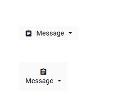

# Icons and Styles

## Dropdown Menu icons

Dropdown Menu can have an icon to provide the visual representation of the action. To place the icon on a Dropdown Menu, set the [`IconCss`](https://help.syncfusion.com/cr/blazor/Syncfusion.Blazor~Syncfusion.Blazor.SplitButtons.SfDropDownButton~IconCss.html) property to `e-icons` with the required icon CSS. By default, the icon is positioned to the left side of the Dropdown Menu. You can customize the icon's position using the [`IconPosition`](https://help.syncfusion.com/cr/blazor/Syncfusion.Blazor~Syncfusion.Blazor.SplitButtons.SfDropDownButton~IconPosition.html) property.

In the following example, the Dropdown Menu with default iconPosition and iconPosition as `Top` is showcased:

```csharp
@using Syncfusion.Blazor.SplitButtons

<SfDropDownButton Items="@DropItems" IconCss="e-icons e-message" content="Message"></SfDropDownButton>
<SfDropDownButton Items="@DropItems" IconCss="e-icons e-message" IconPosition="SplitButtonIconPosition.Top" Content="Message"></SfDropDownButton>

@code {
    public List<DropDownButtonItem> DropItems { get; set; } = new List<DropDownButtonItem>
    {
        new DropDownButtonItem { Text = "Edit" },
        new DropDownButtonItem { Text = "Delete" },
        new DropDownButtonItem { Text = "Mark as Read" },
        new DropDownButtonItem { Text = "Like Message" }
    };
}

<style>
    .e-message::before {
        content: '\e30d';
    }
</style>

```

Output be like



You can also use third party icons on the Dropdown Menu using the [`IconCss`](https://help.syncfusion.com/cr/blazor/Syncfusion.Blazor~Syncfusion.Blazor.SplitButtons.SfDropDownButton~IconCss.html) property.

### Vertical button

Vertical button in Dropdown Menu can be achieved by adding `e-vertical` class using [`CssClass`](https://help.syncfusion.com/cr/blazor/Syncfusion.Blazor~Syncfusion.Blazor.SplitButtons.SfDropDownButton~CssClass.html) property.

```csharp
@using Syncfusion.Blazor.SplitButtons

<SfDropDownButton IconCss="e-icons e-message" CssClass="e-vertical" Content="Message">
    <DropDownButtonItems>
        <DropDownButtonItem Text="Cut"></DropDownButtonItem>
        <DropDownButtonItem Text="Copy"></DropDownButtonItem>
        <DropDownButtonItem Text="Paste"></DropDownButtonItem>
    </DropDownButtonItems>
</SfDropDownButton>

<style>
    .e-message::before {
        content: '\e30d';
    }
</style>

```

Output be like


## See Also

* [Dropdown popup with icons](./popup-items#icons)
* [Customized icon size](./how-to/customize-icon-and-width)