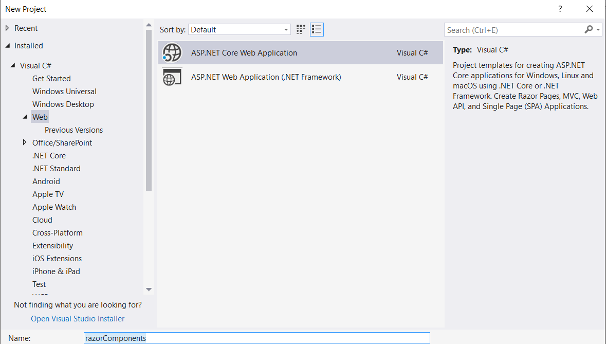
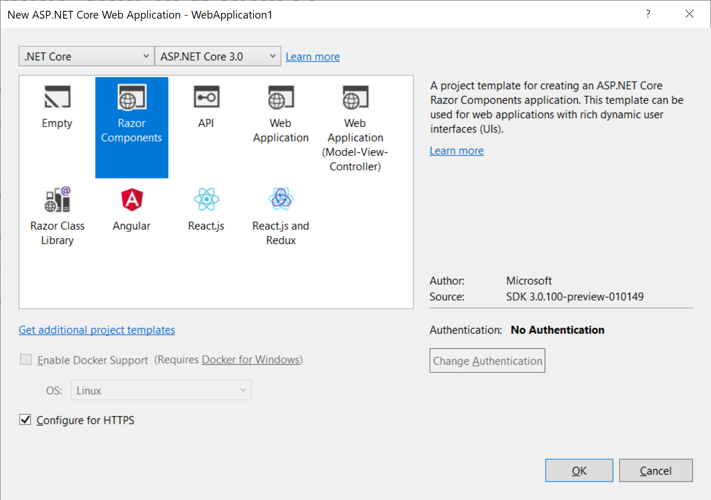
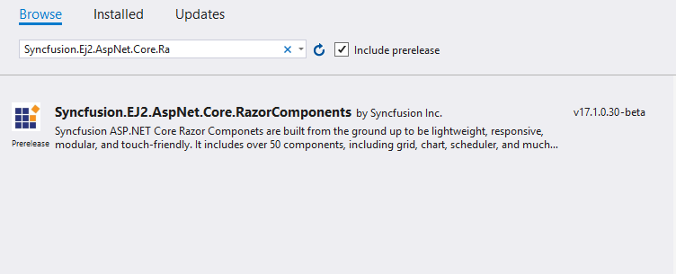
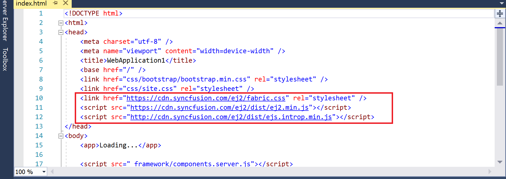

<!-- markdownlint-disable MD024 -->

# Getting Started with Essential JS 2 for ASP.NET Core Razor ProgressButton Component in Visual Studio 2019

This article provides a step-by-step introduction to configure Essential JS 2 setup, build and publish a simple .NET Core Razor ProgressButton Component web application using the [Visual Studio 2019](https://visualstudio.microsoft.com/vs/preview/).

## Prerequisites

The official prerequisites to create and run an ASP.NET Core Razor Components on Windows environment are described in the [.NET Core Razor components documentation website](https://docs.microsoft.com/en-us/aspnet/core/client-side/spa/blazor/get-started?view=aspnetcore-3.0&tabs=visual-studio).

* [Visual Studio 2019 Preview](https://visualstudio.microsoft.com/vs/preview/) with the ASP.NET and web development workload
* [.NET Core SDK 3.0 Preview](https://dotnet.microsoft.com/download/dotnet-core/3.0)

## Create a Razor Component application from VS 2019

1. Choose **File > New > Project...** in the Visual Studio menu bar.

    

2. Make sure **.NET Core** and **ASP.NET Core 3.0** are selected at the top.

    

3. Choose the **Razor Components** template and change the application name, and then click **OK**.

## Importing Essential JS 2 Razor components in the application

1. Now, add the **Syncfusion.EJ2.AspNet.Core.RazorComponents** NuGet package to the new application by using the NuGet Package Manager. Right-click the project and select Manage NuGet Packages.

    

2. Search the **Syncfusion.EJ2.AspNet.Core.RazorComponents** keyword in the Browse tab and install **Syncfusion.EJ2.AspNet.Core.RazorComponents** NuGet package in the application.

    

3. The Essential JS 2 package will be included in the project, after the installation process is completed.

4. Open **~/_ViewImports.cshtml** file and import the `Syncfusion.EJ2.RazorComponents`.

    ```cshtml
    @addTagHelper *, Syncfusion.EJ2.RazorComponents
    ```

5. Add the client-side resources through CDN or local npm package in the `<head>` element of the **~/wwwroot/index.html** page.

    

6. Now, add the Syncfusion Essential JS 2 ProgressButton component in any web page (cshtml) in the `Pages` folder. For example, the ProgressButton component is added in the **~/Pages/Index.cshtml** page.

    ```cshtml
    <EjsProgressButton ID="element" Content="Spin Left"></EjsProgressButton>
    ```

7. Run the application. The Essential JS 2 ProgressButton component will render in the web browser.

    
