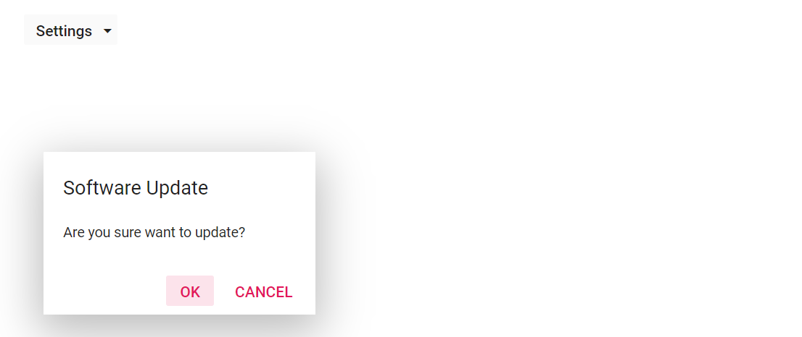

# Open a dialog on popup item click

This section explains about how to open a dialog on Split Button popup item click. This can be achieved by
handling dialog open in [`ItemSelected`](https://help.syncfusion.com/cr/blazor/Syncfusion.Blazor~Syncfusion.Blazor.SplitButtons.SplitButtonEvents~ItemSelected.html) event of the Split Button.

In the following example, Dialog will open while selecting `Update` item.

```csharp

@using Syncfusion.Blazor.SplitButtons
@using Syncfusion.Blazor.Popups
@using Syncfusion.Blazor.Buttons

<SfSplitButton Content="Settings">
    <SplitButtonEvents ItemSelected="select"></SplitButtonEvents>
    <SplitButtonItems>
        <SplitButtonItem Text="Cut" ></SplitButtonItem>
        <SplitButtonItem Text="Copy" ></SplitButtonItem>
        <SplitButtonItem Text="Paste"></SplitButtonItem>
    </SplitButtonItems>
</SfSplitButton>
<SfDialog Content="@Content" Header="@Header" Width="250px" Height="150px" Visible="false" @ref="DialogObj">
    <DialogPositionData X="300" Y="200"></DialogPositionData>
    <DialogButtons>
        <DialogButton ButtonModel="@OkBtn" OnClick="click"></DialogButton>
        <DialogButton ButtonModel="@CancelBtn" OnClick="click"></DialogButton>
    </DialogButtons>
</SfDialog>

@code  {
    SfDialog DialogObj;
    public string Content = "Are you sure want to update?";
    public string Header = "Software Update";

    public ButtonModel OkBtn = new ButtonModel { Content = "OK", IsPrimary = true, CssClass = "e-flat" };
    public ButtonModel CancelBtn = new ButtonModel { Content = "Cancel", IsPrimary = true, CssClass = "e-flat" };

    private void click(object args)
    {
        DialogObj.Hide();
    }

    private void select(MenuEventArgs args)
    {
        if (args.Item.Text == "Update"){
        DialogObj.Show();
    }
    }
}

```

Output be like

