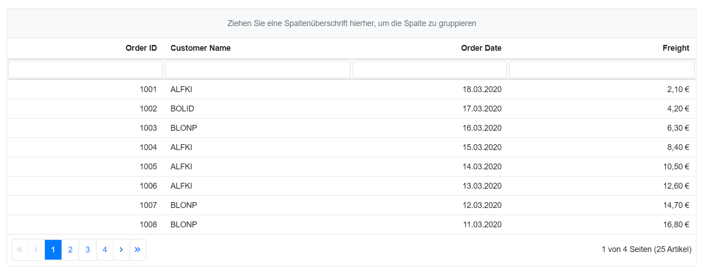

# Globalization

Globalization is the combination of adapting the control to various languages by parsing and formatting the date or number (`Internationalization`) and adding cultural-specific customizations and translating the text (`Localization`).

By default, the component is specific to the `American English` culture. It utilizes the `Blazor Internationalization` package to parse and format the date object based on the culture using the official [UNICODE CLDR](http://cldr.unicode.org/) JSON data. It provides the `LoadLocaleData` and `LoadCldrData` method to load culture-specific CLDR JSON data.

Set Culture and Currency using `SetCulture` and `SetCurrencyCode` property.

To go with different cultures, other than `English`, follow the below steps:

## Load CLDR-Data to an application

* Install the required `CLDR-Data` package using the following URL links in the below mentioned table (it installs the CLDR JSON data). To learn more about CLDR-Data, refer to [CLDR-Data](http://cldr.unicode.org/index/cldr-spec/json).

| CLDR-Data | Links |
| ------------- | ------------- |
| [cldr-core](https://github.com/unicode-cldr/cldr-core/archive/35.1.0.zip) | `cldr-core` package provides the basic CLDR supplemental data. |
[cldr-dates-full](https://github.com/unicode-cldr/cldr-dates-full/archive/35.1.0.zip) | `cldr-dates-full` package provides cldr-data for date/time formatting, including data for Gregorian calendar. Requires that the corresponding cldr-numbers package be installed as well. |
[cldr-numbers-full](https://github.com/unicode-cldr/cldr-numbers-full/archive/35.1.0.zip) | `cldr-numbers-full` package provides cldr-data for number formatting. |
[cldr-cal-islamic-full](https://github.com/unicode-cldr/cldr-cal-islamic-full/archive/35.1.0.zip) | `cldr-numbers-full` package provides islamic cldr-data . |

* Here, we have downloaded the cldr-data of `cldr-dates-full`, `cldr-numbers-full` and `cldr-core` for providing globalization support for grid component. You can find the culture-specific JSON data under the following location: `cldr-dates-full-35.1.0\main`, `cldr-numbers-full-35.1.0\main` and `cldr-core-35.1.0\supplemental` respectively. Then, copy the `main` and `supplemental` folder from corresponding packages into the `wwwroot\cldr-data` folder.

* To download the locale definition of Blazor components, refer to [GitHub](https://github.com/syncfusion/ej2-locale).

* After downloading the `ej2-locale` repository, copy the `ej2-locale` folder with required locale files into the `wwwroot` folder.

* By default, the `ej2-locale` repository contains the localized text for static text present in components like button, placeholder, tooltip, and more.

### Globalization for Blazor Server application

The locale object can be loaded in the `./pages/index.razor` file using the following code snippet. The current locale and currency can be changed for all Syncfusion server-side Blazor components by invoking the `SetCulture` and `SetCurrencyCode` functions with your desired culture name.

Refer to the following code snippet for globalization in server-side Blazor components, where `EUR` is set as curreny code.

```csharp

@functions {
    [Inject]
    protected IJSRuntime JsRuntime { get; set; }

    protected override async Task OnInitializedAsync()
    {
        await base.OnInitializedAsync();
        this.JsRuntime.Ejs().LoadLocaleData("wwwroot/de.json").LoadCldrData("wwwroot/cldr-data/main/de/numbers.json", "wwwroot/cldr-data/main/de/timeZoneNames.json", "wwwroot/cldr-data/main/de/ca-gregorian.json", "wwwroot/cldr-data/main/de/currencies.json", "wwwroot/cldr-data/supplemental/numberingSystems.json").SetCulture("de").SetCurrencyCode("EUR");
    }
}

```

### Globalization for Blazor WebAssembly application

Inject the `HttpClient` module in the `index.razor` file using the following code snippet in the `pages/index.razor` file.

```csharp

@inject HttpClient Http;

```

To load the locale object, read the object using the `http` request, store using variable, and then load as demonstrated in the following code snippet in `./pages/index.razor`. The current locale and currency can be changed for all Syncfusion client-side Blazor components by invoking the `SetCulture` and `SetCurrencyCode` functions with your desired culture name.

Refer to the following code snippet for globalization in client-side Blazor components, where `EUR` is set as curreny code.

```csharp

@functions {
    [Inject]
    protected IJSRuntime JsRuntime { get; set; }

    protected override async Task OnInitializedAsync()
    {
        var data = await Http.GetJsonAsync<object>("ej2-locale/src/de.json");
        var sup1 = await Http.GetJsonAsync<object>("cldr-data/supplemental/numberingSystems.json");
        var sup2 = await Http.GetJsonAsync<object>("cldr-data/main/de/timeZoneNames.json");
        var sup3 = await Http.GetJsonAsync<object>("cldr-data/main/de/ca-gregorian.json");
        var sup4 = await Http.GetJsonAsync<object>("cldr-data/main/de/numbers.json");
        var sup5 = await Http.GetJsonAsync<object>("cldr-data/main/de/currencies.json");

        var cldrData = new object[] { sup1, sup2, sup3, sup4, sup5 };

        this.JsRuntime.Ejs().LoadLocaleData(data).LoadCldrData(cldrData).SetCulture("de").SetCurrencyCode("EUR");
    }
}

```

The following screenshot illustrates the output.


