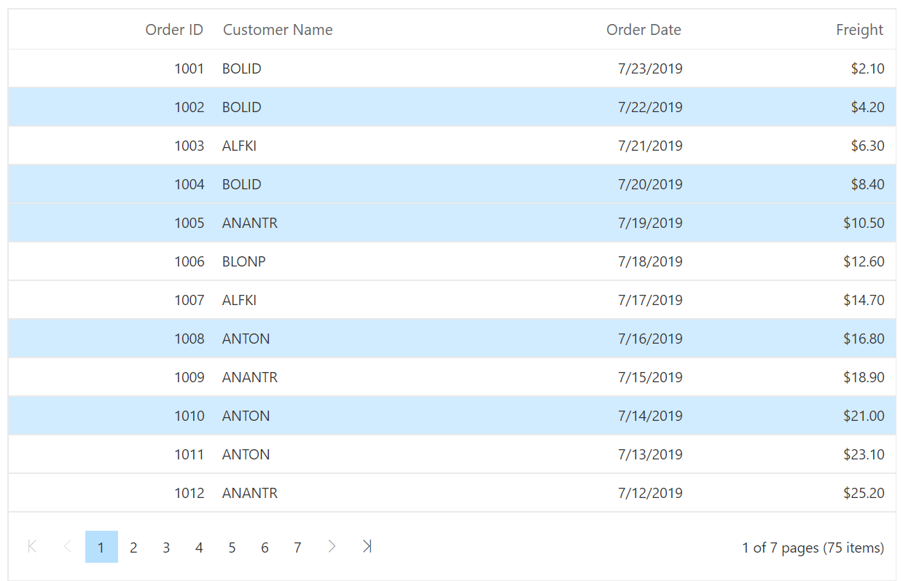
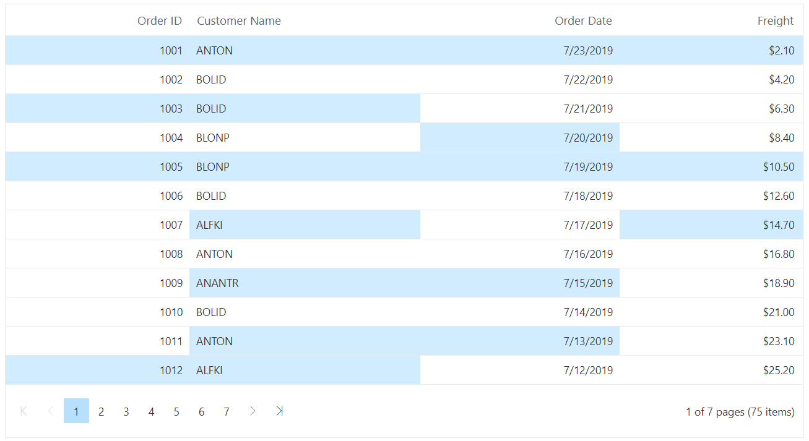
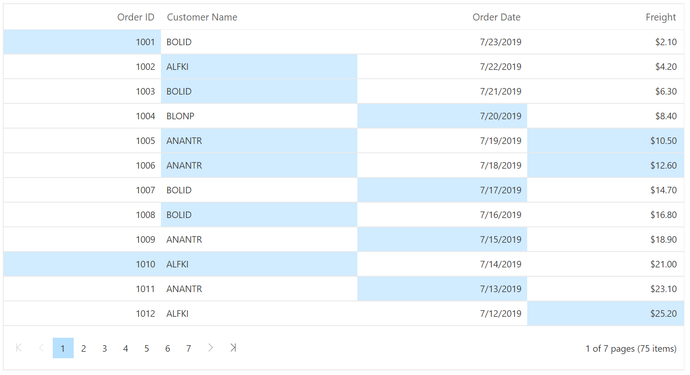
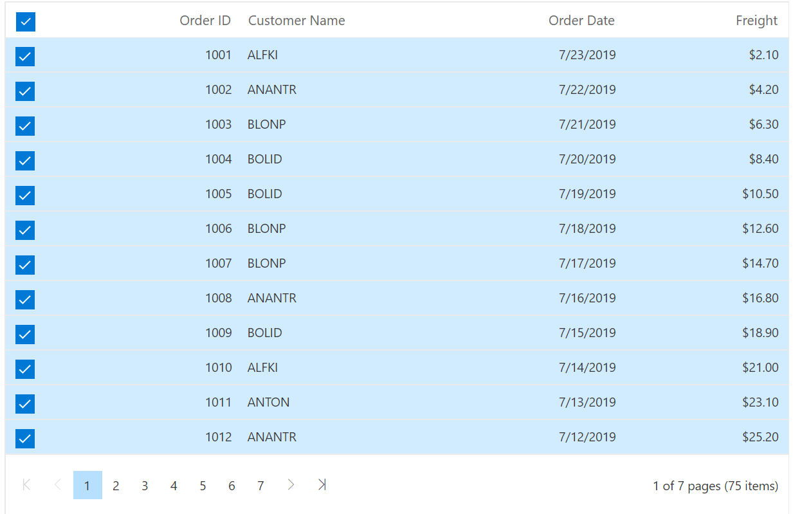
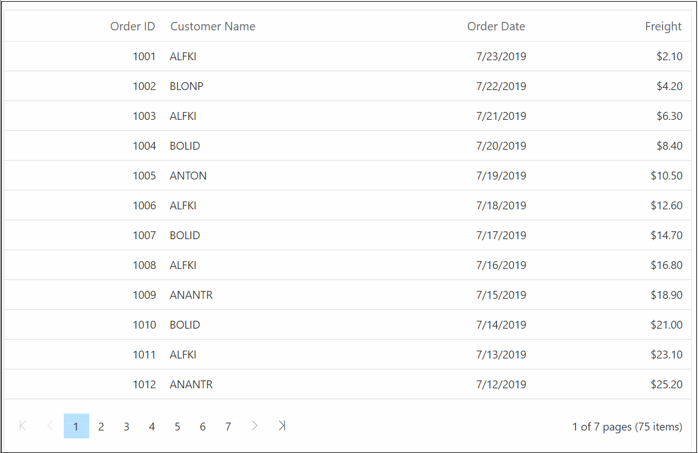
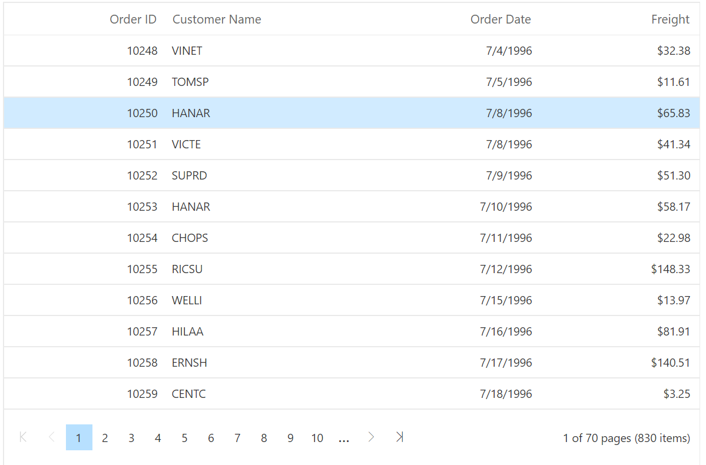
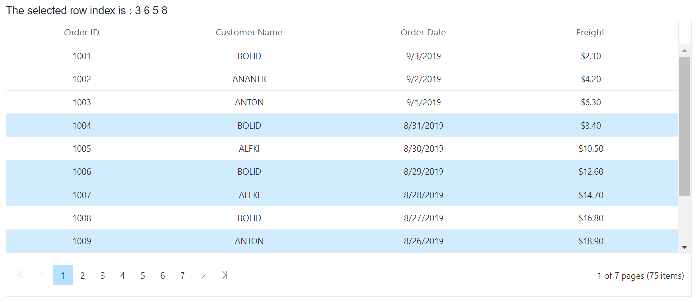
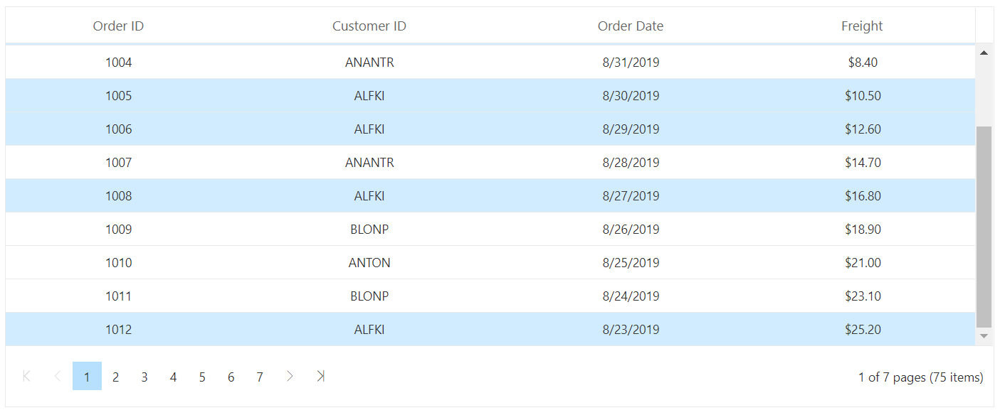

# Selection

Selection provides an option to highlight a row or a cell. It can be done through simple mouse down or arrow keys. To disable selection in the DataGrid, set the [`AllowSelection`](https://help.syncfusion.com/cr/aspnetcore-blazor/Syncfusion.Blazor~Syncfusion.Blazor.Grids.SfGrid~AllowSelection.html) property to false.

The datagrid supports two types of selection that can be set by using the [`Type`](https://help.syncfusion.com/cr/aspnetcore-blazor/Syncfusion.Blazor~Syncfusion.Blazor.Grids.GridSelectionSettings~Type.html) property of **GridSelectionSettings** component. They are:

* **Single**: The **Single** value is set by default, and it only allows selection of a single row or a cell.
* **Multiple**: Allows you to select multiple rows or cells.
To perform the multi-selection, press and hold CTRL key and click the desired rows or cells. To select range of rows or cells, press and hold the SHIFT key and click the rows or cells.

```csharp
@using Syncfusion.Blazor.Grids

<SfGrid DataSource="@Orders" AllowSelection="true" AllowPaging="true">
   <GridSelectionSettings Type="SelectionType.Multiple"></GridSelectionSettings>
      <GridColumns>
         <GridColumn Field=@nameof(Order.OrderID) HeaderText="Order ID" TextAlign="TextAlign.Right" Width="120"></GridColumn>
         <GridColumn Field=@nameof(Order.CustomerID) HeaderText="Customer Name" Width="150"></GridColumn>
         <GridColumn Field=@nameof(Order.OrderDate) HeaderText=" Order Date" Format="d" Type="ColumnType.Date" TextAlign="TextAlign.Right" Width="130"></GridColumn>
         <GridColumn Field=@nameof(Order.Freight) HeaderText="Freight" Format="C2" TextAlign="TextAlign.Right" Width="120"></GridColumn>
      </GridColumns>
</SfGrid>

@code{
    public List<Order> Orders { get; set; }

    protected override void OnInitialized()
    {
        Orders = Enumerable.Range(1, 75).Select(x => new Order()
        {
            OrderID = 1000 + x,
            CustomerID = (new string[] { "ALFKI", "ANANTR", "ANTON", "BLONP", "BOLID" })[new Random().Next(5)],
            Freight = 2.1 * x,
            OrderDate = DateTime.Now.AddDays(-x),
        }).ToList();
    }

    public class Order {
        public int? OrderID { get; set; }
        public string CustomerID { get; set; }
        public DateTime? OrderDate { get; set; }
        public double? Freight { get; set; }
    }
}
```

The following represents the multiple selected rows


## Selection mode

The datagrid supports three types of selection mode that can be set by using
the [`Mode`](https://help.syncfusion.com/cr/aspnetcore-blazor/Syncfusion.Blazor~Syncfusion.Blazor.Grids.GridSelectionSettings~Mode.html) property of **GridSelectionSettings** component. They are:

* **Row**: The **Row** value is set by default, and allows you to select only rows.
* **Cell**: Allows you to select only cells.
* **Both**: Allows you to select rows and cells at the same time.

```csharp
@using Syncfusion.Blazor.Grids

<SfGrid DataSource="@Orders" AllowSelection="true" AllowPaging="true">
   <GridSelectionSettings Mode="SelectionMode.Both" Type="SelectionType.Multiple"></GridSelectionSettings>
      <GridColumns>
         <GridColumn Field=@nameof(Order.OrderID) HeaderText="Order ID" TextAlign="TextAlign.Right" Width="120"></GridColumn>
         <GridColumn Field=@nameof(Order.CustomerID) HeaderText="Customer Name" Width="150"></GridColumn>
         <GridColumn Field=@nameof(Order.OrderDate) HeaderText=" Order Date" Format="d" Type="ColumnType.Date" TextAlign="TextAlign.Right" Width="130"></GridColumn>
         <GridColumn Field=@nameof(Order.Freight) HeaderText="Freight" Format="C2" TextAlign="TextAlign.Right" Width="120"></GridColumn>
      </GridColumns>
</SfGrid>

@code{
    public List<Order> Orders { get; set; }

    protected override void OnInitialized()
    {
        Orders = Enumerable.Range(1, 75).Select(x => new Order()
        {
            OrderID = 1000 + x,
            CustomerID = (new string[] { "ALFKI", "ANANTR", "ANTON", "BLONP", "BOLID" })[new Random().Next(5)],
            Freight = 2.1 * x,
            OrderDate = DateTime.Now.AddDays(-x),
        }).ToList();
    }

    public class Order {
        public int? OrderID { get; set; }
        public string CustomerID { get; set; }
        public DateTime? OrderDate { get; set; }
        public double? Freight { get; set; }
    }
}
```

The following screenshot shows selection mode using both(row and cells selection)


## Cell selection

Cell selection can be done through simple mouse down or arrow keys (up, down, left, and right).

The datagrid supports two types of cell selection mode that can be set by using
the [`CellSelectionMode`](https://help.syncfusion.com/cr/aspnetcore-blazor/Syncfusion.Blazor~Syncfusion.Blazor.Grids.GridSelectionSettings~Mode.html) property of **GridSelectionSettings** component. They are:

* **Flow**: The **Flow** value is set by default. The range of cells are selected between the start index and end index that includes in between cells of rows.
* **Box**: Range of cells are selected from the start and end column indexes that includes in between cells of rows within the range.

```csharp
@using Syncfusion.Blazor.Grids

<SfGrid DataSource="@Orders" AllowSelection="true" AllowPaging="true">
    <GridSelectionSettings CellSelectionMode="CellSelectionMode.Box" Mode="SelectionMode.Cell" Type="SelectionType.Multiple"></GridSelectionSettings>
    <GridColumns>
        <GridColumn Field=@nameof(Order.OrderID) HeaderText="Order ID" TextAlign="TextAlign.Right" Width="120"></GridColumn>
        <GridColumn Field=@nameof(Order.CustomerID) HeaderText="Customer Name" Width="150"></GridColumn>
        <GridColumn Field=@nameof(Order.OrderDate) HeaderText=" Order Date" Format="d" Type="ColumnType.Date" TextAlign="TextAlign.Right" Width="130"></GridColumn>
        <GridColumn Field=@nameof(Order.Freight) HeaderText="Freight" Format="C2" TextAlign="TextAlign.Right" Width="120"></GridColumn>
    </GridColumns>
</SfGrid>

@code{
    public List<Order> Orders { get; set; }

    protected override void OnInitialized()
    {
        Orders = Enumerable.Range(1, 75).Select(x => new Order()
        {
            OrderID = 1000 + x,
            CustomerID = (new string[] { "ALFKI", "ANANTR", "ANTON", "BLONP", "BOLID" })[new Random().Next(5)],
            Freight = 2.1 * x,
            OrderDate = DateTime.Now.AddDays(-x),
        }).ToList();
    }

    public class Order {
        public int? OrderID { get; set; }
        public string CustomerID { get; set; }
        public DateTime? OrderDate { get; set; }
        public double? Freight { get; set; }
    }
}
```

The following screenshot shows selection mode using cell


> Cell selection requires the [`Mode`](https://help.syncfusion.com/cr/aspnetcore-blazor/Syncfusion.Blazor~Syncfusion.Blazor.Grids.GridSelectionSettings~Mode.html) to be **Cell** or **Both**, and
[`Type`](https://help.syncfusion.com/cr/aspnetcore-blazor/Syncfusion.Blazor~Syncfusion.Blazor.Grids.GridSelectionSettings~Type.html) should be **Multiple**.

## Checkbox selection

Checkbox selection provides an option to select multiple datagrid records with help of checkbox in each row.

To render the checkbox in each datagrid row, you need to use checkbox column with type as **CheckBox** using the  column [`Type`](https://help.syncfusion.com/cr/aspnetcore-blazor/Syncfusion.Blazor~Syncfusion.Blazor.Grids.GridColumn~Type.html) property of **GridColumn** component.

```csharp
@using Syncfusion.Blazor.Grids

<SfGrid DataSource="@Orders" AllowSelection="true" AllowPaging="true">
    <GridSelectionSettings Type="SelectionType.Multiple"></GridSelectionSettings>
    <GridColumns>
        <GridColumn Type="ColumnType.CheckBox" Width="50"></GridColumn>
        <GridColumn Field=@nameof(Order.OrderID) HeaderText="Order ID" TextAlign="TextAlign.Right" Width="120"></GridColumn>
        <GridColumn Field=@nameof(Order.CustomerID) HeaderText="Customer Name" Width="150"></GridColumn>
        <GridColumn Field=@nameof(Order.OrderDate) HeaderText=" Order Date" Format="d" Type="ColumnType.Date" TextAlign="TextAlign.Right" Width="130"></GridColumn>
        <GridColumn Field=@nameof(Order.Freight) HeaderText="Freight" Format="C2" TextAlign="TextAlign.Right" Width="120"></GridColumn>
    </GridColumns>
</SfGrid>

@code{
    public List<Order> Orders { get; set; }

    protected override void OnInitialized()
    {
        Orders = Enumerable.Range(1, 75).Select(x => new Order()
        {
            OrderID = 1000 + x,
            CustomerID = (new string[] { "ALFKI", "ANANTR", "ANTON", "BLONP", "BOLID" })[new Random().Next(5)],
            Freight = 2.1 * x,
            OrderDate = DateTime.Now.AddDays(-x),
        }).ToList();
    }

    public class Order {
        public int? OrderID { get; set; }
        public string CustomerID { get; set; }
        public DateTime? OrderDate { get; set; }
        public double? Freight { get; set; }
    }
}
```

The following screenshot shows CheckBox Selection


> By default, selection is allowed by clicking a datagrid row or checkbox in that row. To allow selection only through checkbox, you can set the
[`CheckboxOnly`](https://help.syncfusion.com/cr/aspnetcore-blazor/Syncfusion.Blazor~Syncfusion.Blazor.Grids.GridSelectionSettings~CheckboxOnly.html) property of **GridSelectionSettings** as true.
> Selection can be persisted in all the operations using the [`PersistSelection`](https://help.syncfusion.com/cr/aspnetcore-blazor/Syncfusion.Blazor~Syncfusion.Blazor.Grids.GridSelectionSettings~PersistSelection.html) property of **GridSelectionSettings**.
For persisting selection on the datagrid, any one of the columns should be defined as a primary key using the [`IsPrimaryKey`](https://help.syncfusion.com/cr/aspnetcore-blazor/Syncfusion.Blazor~Syncfusion.Blazor.Grids.GridColumn~IsPrimaryKey.html) property.

### Checkbox selection mode

In checkbox selection, selection can also be done by clicking on rows. This selection provides two types of Checkbox Selection mode which can be set by using the following API,
[`CheckboxMode`](https://help.syncfusion.com/cr/aspnetcore-blazor/Syncfusion.Blazor~Syncfusion.Blazor.Grids.GridSelectionSettings~CheckboxMode.html). The modes are;

* **Default**: This is the default value of the checkboxMode. In this mode, user can select multiple rows by clicking rows one by one.
* **ResetOnRowClick**: In ResetOnRowClick mode, when user clicks on a row it will reset previously selected row. Also you can perform multiple-selection in this mode by press
and hold CTRL key and click the desired rows. To select range of rows, press and hold the SHIFT key and click the rows.

```csharp
@using Syncfusion.Blazor.Grids

<SfGrid DataSource="@Orders" AllowSelection="true" AllowPaging="true">
    <GridSelectionSettings CheckboxMode="CheckboxSelectionType.ResetOnRowClick" Type="SelectionType.Multiple"></GridSelectionSettings>
    <GridColumns>
        <GridColumn Type="ColumnType.CheckBox" Width="50"></GridColumn>
        <GridColumn Field=@nameof(Order.OrderID) HeaderText="Order ID" TextAlign="TextAlign.Right" Width="120"></GridColumn>
        <GridColumn Field=@nameof(Order.CustomerID) HeaderText="Customer Name" Width="150"></GridColumn>
        <GridColumn Field=@nameof(Order.OrderDate) HeaderText=" Order Date" Format="d" Type="ColumnType.Date" TextAlign="TextAlign.Right" Width="130"></GridColumn>
        <GridColumn Field=@nameof(Order.Freight) HeaderText="Freight" Format="C2" TextAlign="TextAlign.Right" Width="120"></GridColumn>
    </GridColumns>
</SfGrid>

@code{
    public List<Order> Orders { get; set; }

    protected override void OnInitialized()
    {
        Orders = Enumerable.Range(1, 75).Select(x => new Order()
        {
            OrderID = 1000 + x,
            CustomerID = (new string[] { "ALFKI", "ANANTR", "ANTON", "BLONP", "BOLID" })[new Random().Next(5)],
            Freight = 2.1 * x,
            OrderDate = DateTime.Now.AddDays(-x),
        }).ToList();
    }

    public class Order {
        public int? OrderID { get; set; }
        public string CustomerID { get; set; }
        public DateTime? OrderDate { get; set; }
        public double? Freight { get; set; }
    }
}
```

## Toggle selection

The Toggle selection allows to perform selection and unselection of the particular row or cell. To enable toggle selection, set [`EnableToggle`](https://help.syncfusion.com/cr/aspnetcore-blazor/Syncfusion.Blazor~Syncfusion.Blazor.Grids.GridSelectionSettings~EnableToggle.html) property of **GridSelectionSettings** as true. If you click on the selected row or cell then it will be unselected and vice versa.

```csharp
@using Syncfusion.Blazor.Grids

<SfGrid DataSource="@Orders" AllowSelection="true" AllowPaging="true">
    <GridSelectionSettings EnableToggle="true" Type="SelectionType.Multiple"></GridSelectionSettings>
    <GridColumns>
        <GridColumn Field=@nameof(Order.OrderID) HeaderText="Order ID" TextAlign="TextAlign.Right" Width="120"></GridColumn>
        <GridColumn Field=@nameof(Order.CustomerID) HeaderText="Customer Name" Width="150"></GridColumn>
        <GridColumn Field=@nameof(Order.OrderDate) HeaderText=" Order Date" Format="d" Type="ColumnType.Date" TextAlign="TextAlign.Right" Width="130"></GridColumn>
        <GridColumn Field=@nameof(Order.Freight) HeaderText="Freight" Format="C2" TextAlign="TextAlign.Right" Width="120"></GridColumn>
    </GridColumns>
</SfGrid>

@code{
    public List<Order> Orders { get; set; }

    protected override void OnInitialized()
    {
        Orders = Enumerable.Range(1, 75).Select(x => new Order()
        {
            OrderID = 1000 + x,
            CustomerID = (new string[] { "ALFKI", "ANANTR", "ANTON", "BLONP", "BOLID" })[new Random().Next(5)],
            Freight = 2.1 * x,
            OrderDate = DateTime.Now.AddDays(-x),
        }).ToList();
    }

    public class Order {
        public int? OrderID { get; set; }
        public string CustomerID { get; set; }
        public DateTime? OrderDate { get; set; }
        public double? Freight { get; set; }
    }
}
```

The following shows selection and deselection of row


> If multi selection is enabled, then first click on any selected row (without pressing Ctrl key), it will clear the multi selection and in second click on the same row, it will be unselected.

## Select row at initial rendering

To select a row at initial rendering, set the [`SelectedRowIndex`](https://help.syncfusion.com/cr/aspnetcore-blazor/Syncfusion.Blazor~Syncfusion.Blazor.Grids.SfGrid~SelectedRowIndex.html) value.

```csharp
@using Syncfusion.Blazor.Grids

<SfGrid DataSource="@Orders" AllowSelection="true" SelectedRowIndex="2" AllowPaging="true">
    <GridSelectionSettings Mode="SelectionMode.Both" Type="SelectionType.Multiple">
    </GridSelectionSettings>
    <GridColumns>
        <GridColumn Field=@nameof(Order.OrderID) HeaderText="Order ID" TextAlign="TextAlign.Right" Width="120"></GridColumn>
        <GridColumn Field=@nameof(Order.CustomerID) HeaderText="Customer Name" Width="150"></GridColumn>
        <GridColumn Field=@nameof(Order.OrderDate) HeaderText=" Order Date" Format="d" Type="ColumnType.Date" TextAlign="TextAlign.Right" Width="130"></GridColumn>
        <GridColumn Field=@nameof(Order.Freight) HeaderText="Freight" Format="C2" TextAlign="TextAlign.Right" Width="120"></GridColumn>
    </GridColumns>
</SfGrid>

@code{
    public List<Order> Orders { get; set; }

    protected override void OnInitialized()
    {
        Orders = Enumerable.Range(1, 75).Select(x => new Order()
        {
            OrderID = 1000 + x,
            CustomerID = (new string[] { "ALFKI", "ANANTR", "ANTON", "BLONP", "BOLID" })[new Random().Next(5)],
            Freight = 2.1 * x,
            OrderDate = DateTime.Now.AddDays(-x),
        }).ToList();
    }

    public class Order {
        public int? OrderID { get; set; }
        public string CustomerID { get; set; }
        public DateTime? OrderDate { get; set; }
        public double? Freight { get; set; }
    }
}
```

The following image will be displayed with row selected in initial Rendering  


## Get selected row indexes

You can get the selected row indexes by using [`RowSelected`](https://help.syncfusion.com/cr/aspnetcore-blazor/Syncfusion.Blazor~Syncfusion.Blazor.Grids.SfGrid~RowSelected.html)

```csharp
@using Syncfusion.Blazor
@using Syncfusion.Blazor.Grids

<span> The selected row index is : @SelectedValue </span>

<SfGrid @ref="@Grid" DataSource="@Orders" AllowFiltering="true" AllowPaging="true" Height="315">
    <GridSelectionSettings Type="SelectionType.Multiple"></GridSelectionSettings>
    <GridEvents RowSelected="GetSelectedRecords" TValue="Order"></GridEvents>
    <GridColumns>
        <GridColumn Field=@nameof(Order.OrderID) HeaderText="Order ID" TextAlign="TextAlign.Center" Width="120"></GridColumn>
        <GridColumn Field=@nameof(Order.CustomerID) HeaderText="Customer Name" TextAlign="TextAlign.Center" Width="150"></GridColumn>
        <GridColumn Field=@nameof(Order.OrderDate) HeaderText=" Order Date" Format="d" Type="ColumnType.Date" TextAlign="TextAlign.Center" Width="130"></GridColumn>
        <GridColumn Field=@nameof(Order.Freight) HeaderText="Freight" Format="C2" TextAlign="TextAlign.Center" Width="140"></GridColumn>
    </GridColumns>
</SfGrid>

@code{

    SfGrid<Order> Grid;
    public List<Order> Orders { get; set; }
    public List<double> SelectedRowIndexes { get; set; }
    public double[] TotalValue { get; set; }
    public string SelectedValue;

    protected override void OnInitialized()
    {
        Orders = Enumerable.Range(1, 75).Select(x => new Order()
        {
            OrderID = 1000 + x,
            CustomerID = (new string[] { "ALFKI", "ANANTR", "ANTON", "BLONP", "BOLID" })[new Random().Next(5)],
            Freight = 2.1 * x,
            OrderDate = DateTime.Now.AddDays(-x),
        }).ToList();
    }

    public async Task GetSelectedRecords(RowSelectEventArgs<Order> args)
    {
        SelectedRowIndexes = await this.Grid.GetSelectedRowIndexes();
        TotalValue = SelectedRowIndexes.ToArray();
        SelectedValue = "";
        foreach (var data in TotalValue)
        {
            SelectedValue = SelectedValue + " " + data;
        }
        StateHasChanged();
    }

    public class Order
    {
        public int? OrderID { get; set; }
        public string CustomerID { get; set; }
        public DateTime? OrderDate { get; set; }
        public double? Freight { get; set; }
    }
}
```

The following image will be displayed with selected row and its indexes  


## Touch interaction

When you tap a datagrid row on touchscreen device, the tapped row is selected.
It also shows a popup   for multi-row selection.
To select multiple rows or cells, tap the popup  and then tap the desired rows or cells.

> Multi-selection requires the selection [`type`](https://help.syncfusion.com/cr/aspnetcore-blazor/Syncfusion.Blazor~Syncfusion.Blazor.Grids.GridSelectionSettings~_type.html) to be `multiple`.

The following screenshot represents a datagrid touch selection in the device.


## Multiple selection based on condition

You can select multiple rows at the initial rendering of the datagrid by using [`SelectRows`](https://help.syncfusion.com/cr/aspnetcore-blazor/Syncfusion.Blazor~Syncfusion.Blazor.Grids.SfGrid%601~SelectRows.html). The initial selection is based on the condition which we given. Here the initial selection is based on the row which is having the **CustomerID** as **ALFKI**. We have used [`GetCurrentViewRecords`](https://help.syncfusion.com/cr/aspnetcore-blazor/Syncfusion.Blazor~Syncfusion.Blazor.Grids.SfGrid%601~GetCurrentViewRecords.html) method to get current page records and applied the condition.

```csharp
@using Syncfusion.Blazor.Grids

<SfGrid @ref="@Grid" DataSource="@Orders" AllowFiltering="true" AllowPaging="true" Height="315">
    <GridSelectionSettings Type="SelectionType.Multiple"></GridSelectionSettings>
    <GridEvents DataBound="Data" TValue="Order"></GridEvents>
    <GridColumns>
        <GridColumn Field=@nameof(Order.OrderID) HeaderText="Order ID" TextAlign="TextAlign.Center" Width="120"></GridColumn>
        <GridColumn Field=@nameof(Order.CustomerID) HeaderText="Customer ID" TextAlign="TextAlign.Center" Width="150"></GridColumn>
        <GridColumn Field=@nameof(Order.OrderDate) HeaderText=" Order Date" Format="d" Type="ColumnType.Date" TextAlign="TextAlign.Center" Width="130"></GridColumn>
        <GridColumn Field=@nameof(Order.Freight) HeaderText="Freight" Format="C2" TextAlign="TextAlign.Center" Width="120"></GridColumn>
    </GridColumns>
</SfGrid>

@code{

    SfGrid<Order> Grid;
    public List<Order> Orders { get; set; }
    List<double> SelectIndex { get; set; }

    protected override void OnInitialized()
    {
        Orders = Enumerable.Range(1, 75).Select(x => new Order()
        {
            OrderID = 1000 + x,
            CustomerID = (new string[] { "ALFKI", "ANANTR", "ANTON", "BLONP", "BOLID" })[new Random().Next(5)],
            Freight = 2.1 * x,
            OrderDate = DateTime.Now.AddDays(-x),
        }).ToList();
    }

    public async Task Data(object args)
    {
        var Source = await Grid.GetCurrentViewRecords();
        var IndexNum = 0;
        SelectIndex = new List<double>();
        foreach (var record in Source)
        {
            if (record.CustomerID == "ALFKI")
            {
                SelectIndex.Add(IndexNum);
            }
            IndexNum++;
        }
        await Grid.SelectRows(SelectIndex.ToArray());
    }

    public class Order
    {
        public int? OrderID { get; set; }
        public string CustomerID { get; set; }
        public DateTime? OrderDate { get; set; }
        public double? Freight { get; set; }
    }
}
```

The following image will be displayed with Multiple selection  


## Simple multiple row selection

You can select multiple rows by clicking on rows one by one. This will not deselect the previously selected rows. To deselect the previously selected row, you can click on the  selected row. You can enable this behavior by using [`EnableSimpleMultiRowSelection`](https://help.syncfusion.com/cr/aspnetcore-blazor/Syncfusion.Blazor~Syncfusion.Blazor.Grids.GridSelectionSettings~EnableSimpleMultiRowSelection.html) property of **GridSelectionSettings** component.

```csharp
@using Syncfusion.Blazor.Grids

<SfGrid DataSource="@Orders" AllowSelection="true" AllowPaging="true">
    <GridSelectionSettings EnableSimpleMultiRowSelection="true" Type="SelectionType.Multiple"></GridSelectionSettings>
    <GridColumns>
        <GridColumn Field=@nameof(Order.OrderID) HeaderText="Order ID" TextAlign="TextAlign.Right" Width="120"></GridColumn>
        <GridColumn Field=@nameof(Order.CustomerID) HeaderText="Customer Name" Width="150"></GridColumn>
        <GridColumn Field=@nameof(Order.OrderDate) HeaderText=" Order Date" Format="d" Type="ColumnType.Date" TextAlign="TextAlign.Right" Width="130"></GridColumn>
        <GridColumn Field=@nameof(Order.Freight) HeaderText="Freight" Format="C2" TextAlign="TextAlign.Right" Width="120"></GridColumn>
    </GridColumns>
</SfGrid>

@code{
    public List<Order> Orders { get; set; }

    protected override void OnInitialized()
    {
        Orders = Enumerable.Range(1, 75).Select(x => new Order()
        {
            OrderID = 1000 + x,
            CustomerID = (new string[] { "ALFKI", "ANANTR", "ANTON", "BLONP", "BOLID" })[new Random().Next(5)],
            Freight = 2.1 * x,
            OrderDate = DateTime.Now.AddDays(-x),
        }).ToList();
    }

    public class Order {
        public int? OrderID { get; set; }
        public string CustomerID { get; set; }
        public DateTime? OrderDate { get; set; }
        public double? Freight { get; set; }
    }
}
```
