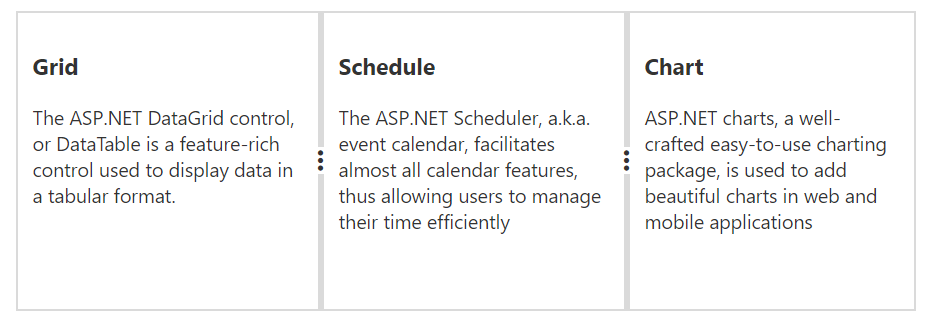
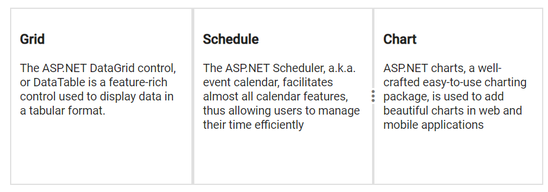
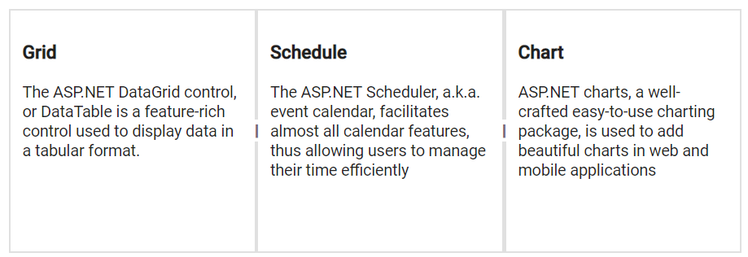

# Resize

By default, resizing will be enabled for split panes. Resizing gripper element will be added to the separator to makes the resize easy.

> Horizontal splitter allows you to resize in horizontal directions.
> Vertical splitter allows you to resize in vertical directions.

While resizing, previous and next panes will adjust its dimensions automatically.

## Min and Max validation

Splitter allows you to set the minimum and maximum sizes for each pane. Resizing will not be occurred over the minimum and maximum values.

```csharp

@using Syncfusion.Blazor.Layouts

<SfSplitter Height="200px" Width="600px" SeparatorSize=4>
    <SplitterPanes>
        <SplitterPane Size="200px" Min="20%" Max="40%">
            <ContentTemplate>
                <div>
                    <div class="content">
                        <h3 class="h3">Grid </h3>
                        The ASP.NET DataGrid control, or DataTable is a feature-rich control used to display data in a tabular format.
                    </div>
                </div>
            </ContentTemplate>
        </SplitterPane>
        <SplitterPane Size="200px" Min="30%" Max="60%">
            <ContentTemplate>
                <div>
                    <div class="content">
                        <h3 class="h3">Schedule </h3>
                        The ASP.NET Scheduler, a.k.a. event calendar, facilitates almost all calendar features, thus allowing users to manage their time efficiently
                    </div>
                </div>
            </ContentTemplate>
        </SplitterPane>
        <SplitterPane>
            <ContentTemplate>
                <div>
                    <div class="content">
                        <h3 class="h3">Chart </h3>
                        ASP.NET charts, a well-crafted easy-to-use charting package, is used to add beautiful charts in web and mobile applications
                    </div>
                </div>
            </ContentTemplate>
        </SplitterPane>
    </SplitterPanes>
</SfSplitter>

<style>
    .content {
        padding: 10px;
    }
</style>

```

The output will be as follows.



## Prevent resizing

You can disable the resizing for the pane by setting `false` to the `Resizable` API within `SplitterPane`.

> Splitter resizing will be enabled only when the target of the adjacent pane's `Resizable` api should also be in `true` state.

```csharp

@using Syncfusion.Blazor.Layouts

<SfSplitter Height="200px" Width="600px" SeparatorSize=4>
    <SplitterPanes>
        <SplitterPane Size="200px" Min="20%" Max="40%" Resizable="false">
            <ContentTemplate>
                <div>
                    <div class="content">
                        <h3 class="h3">Grid </h3>
                        The ASP.NET DataGrid control, or DataTable is a feature-rich control used to display data in a tabular format.
                    </div>
                </div>
            </ContentTemplate>
        </SplitterPane>
        <SplitterPane Size="200px" Min="30%" Max="60%">
            <ContentTemplate>
                <div>
                    <div class="content">
                        <h3 class="h3">Schedule </h3>
                        The ASP.NET Scheduler, a.k.a. event calendar, facilitates almost all calendar features, thus allowing users to manage their time efficiently
                    </div>
                </div>
            </ContentTemplate>
        </SplitterPane>
        <SplitterPane>
            <ContentTemplate>
                <div>
                    <div class="content">
                        <h3 class="h3">Chart </h3>
                        ASP.NET charts, a well-crafted easy-to-use charting package, is used to add beautiful charts in web and mobile applications
                    </div>
                </div>
            </ContentTemplate>
        </SplitterPane>
    </SplitterPanes>
</SfSplitter>

<style>
    .content {
        padding: 10px;
    }
</style>

```

The output will be as follows.



## Refresh content on resizing

While resizing the panes, you can refresh the pane contents by using either `OnResizeStart`, `Resizing` or `OnResizeStop`.

## Customize the resize grip and cursor

You can customize the resize gripper icon and cursor in css level.

```csharp

@using Syncfusion.Blazor.Layouts

<SfSplitter Height="200px" Width="600px" SeparatorSize=3>
    <SplitterPanes>
        <SplitterPane Size="200px" Min="20%" Max="40%">
            <ContentTemplate>
                <div>
                    <div class="content">
                        <h3 class="h3">Grid </h3>
                        The ASP.NET DataGrid control, or DataTable is a feature-rich control used to display data in a tabular format.
                    </div>
                </div>
            </ContentTemplate>
        </SplitterPane>
        <SplitterPane Size="200px" Min="30%" Max="60%">
            <ContentTemplate>
                <div>
                    <div class="content">
                        <h3 class="h3">Schedule </h3>
                        The ASP.NET Scheduler, a.k.a. event calendar, facilitates almost all calendar features, thus allowing users to manage their time efficiently
                    </div>
                </div>
            </ContentTemplate>
        </SplitterPane>
        <SplitterPane>
            <ContentTemplate>
                <div>
                    <div class="content">
                        <h3 class="h3">Chart </h3>
                        ASP.NET charts, a well-crafted easy-to-use charting package, is used to add beautiful charts in web and mobile applications
                    </div>
                </div>
            </ContentTemplate>
        </SplitterPane>
    </SplitterPanes>
</SfSplitter>

<style>
    .content {
        padding: 10px;
    }
    .e-splitter .e-split-bar .e-resize-handler:before {
      content: "\e934";
      font-family: 'e-icons';
      font-size: 11px;
      transform: rotate(90deg);
    }
    .e-splitter .e-split-bar.e-split-bar-horizontal.e-resizable-split-bar,
    .e-splitter .e-split-bar.e-split-bar-horizontal.e-resizable-split-bar::after {
        cursor: e-resize;
    }
</style>

```

The output will be as follows.



## See Also

* [Collapsible panes](./expand-and-collapse/)