# Pivot Chart

In pivot table component, pivot chart would act as an additional visualization component with its basic and important characteristic like drill down and drill up, 15+ chart types, series customization, axis customization, legend customization, export, print and tooltip. Its main purpose is to show the pivot data in graphical format.

If user prefers, the pivot chart component can also be displayed individually with pivot values and can change the report dynamically with the help of field list and grouping bar. Using the [`PivotViewDisplayOption`](https://help.syncfusion.com/cr/cref_files/blazor/Syncfusion.Blazor~Syncfusion.Blazor.PivotView.PivotViewDisplayOption.html) property in [`SfPivotView`](https://help.syncfusion.com/cr/blazor/Syncfusion.Blazor~Syncfusion.Blazor.PivotView.SfPivotView%601.html) class, user can set the visibility of grid and chart in pivot table component. It holds below properties,

* [`View`](https://help.syncfusion.com/cr/blazor/Syncfusion.Blazor~Syncfusion.Blazor.PivotView.PivotViewDisplayOption~View.html): Specifies the pivot table component to display grid alone or chart alone or both.
* [`Primary`](https://help.syncfusion.com/cr/blazor/Syncfusion.Blazor~Syncfusion.Blazor.PivotView.PivotViewDisplayOption~Primary.html): Specifies the pivot table to display either grid or chart as primary component during initial loading. It is applicable only when setting the property [`View`](https://help.syncfusion.com/cr/blazor/Syncfusion.Blazor~Syncfusion.Blazor.PivotView.PivotViewDisplayOption~View.html) to [**View.Both**](https://help.syncfusion.com/cr/cref_files/blazor/Syncfusion.Blazor~Syncfusion.Blazor.PivotView.View.html).

The below sample displays the pivot chart component based on the pivot report bound on it.

```csharp
    @using Syncfusion.Blazor.PivotView

    <SfPivotView TValue="ProductDetails" Width="800" Height="500">
         <PivotViewDataSourceSettings DataSource="@data">
            <PivotViewColumns>
                <PivotViewColumn Name="Country"></PivotViewColumn>
                <PivotViewColumn Name="Products"></PivotViewColumn>
            </PivotViewColumns>
            <PivotViewRows>
                <PivotViewRow Name="Year"></PivotViewRow>
                <PivotViewRow Name="Quarter"></PivotViewRow>
            </PivotViewRows>
            <PivotViewValues>
                <PivotViewValue Name="Sold" Caption="Unit Sold"></PivotViewValue>
                <PivotViewValue Name="Amount" Caption="Sold Amount"></PivotViewValue>
            </PivotViewValues>
            <PivotViewFormatSettings>
                <PivotViewFormatSetting Name="Amount" Format="C"></PivotViewFormatSetting>
            </PivotViewFormatSettings>
        </PivotViewDataSourceSettings>
        <PivotViewDisplayOption View=View.Chart></PivotViewDisplayOption>
        <PivotChartSettings Title="Sales Analysis">
            <PivotChartSeries Type=ChartSeriesType.Column></PivotChartSeries>
        </PivotChartSettings>
    </SfPivotView>

    @code{
        public List<ProductDetails> data { get; set; }
        protected override void OnInitialized()
        {
            this.data = ProductDetails.GetProductData().ToList();
           //Bind the data source collection here. Refer "Assigning sample data to the pivot table" section in getting started for more details.
        }
    }

```

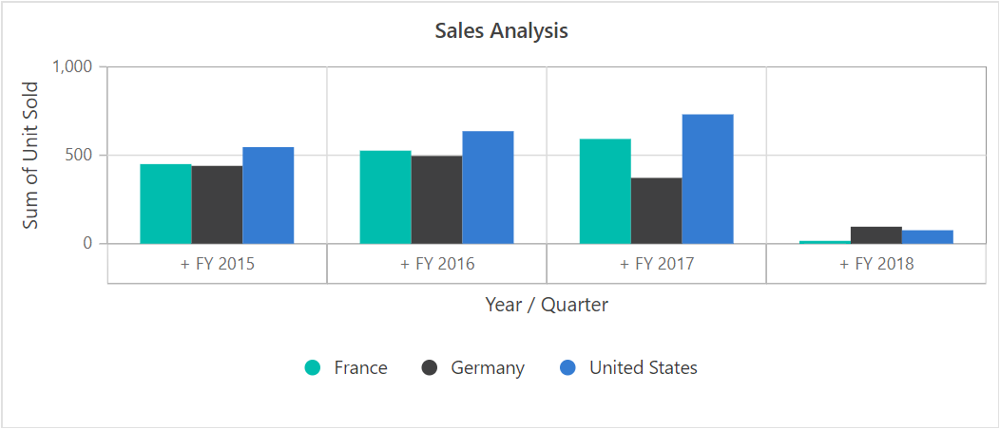

## Data Binding

End user can bind both local and remote data binding options available in the component to feed the data. The [`DataSource`](https://help.syncfusion.com/cr/blazor/Syncfusion.Blazor~Syncfusion.Blazor.PivotView.DataSourceSettingsModel%601~DataSource.html) property can be assigned either with an instance of [`SfDataManager`](https://help.syncfusion.com/cr/blazor/Syncfusion.Blazor~Syncfusion.Blazor.DataManager.html) or list of object.
For more information [`refer`](./data-binding) here.

## Chart Types

Supports 19 different types of charts as follows,

* Line
* Column
* Area
* Bar
* StepArea
* StackingColumn
* StackingArea
* StackingBar
* StepLine
* Pareto
* Bubble
* Scatter
* Spline
* SplineArea
* StackingColumn100
* StackingBar100
* StackingArea100
* Polar
* Radar

[**ChartSeriesType.Line**](https://help.syncfusion.com/cr/cref_files/blazor/Syncfusion.Blazor~Syncfusion.Blazor.PivotView.ChartSeriesType.html) is the default pivot chart type. User can change the pivot chart type by using the property [`Type`](https://help.syncfusion.com/cr/blazor/Syncfusion.Blazor~Syncfusion.Blazor.PivotView.PivotChartSeries~Type.html) in [`PivotChartSeries`](https://help.syncfusion.com/cr/blazor/Syncfusion.Blazor~Syncfusion.Blazor.PivotView.PivotChartSettings~ChartSeries.html) class.

In the below code sample, the pivot chart type is set as [**ChartSeriesType.Bar**](https://help.syncfusion.com/cr/cref_files/blazor/Syncfusion.Blazor~Syncfusion.Blazor.PivotView.ChartSeriesType.html).

```csharp
    @using Syncfusion.Blazor.PivotView

    <SfPivotView TValue="ProductDetails">
        <PivotViewDataSourceSettings DataSource="@data">
            <PivotViewColumns>
                <PivotViewColumn Name="Country"></PivotViewColumn>
                <PivotViewColumn Name="Products"></PivotViewColumn>
            </PivotViewColumns>
            <PivotViewRows>
                <PivotViewRow Name="Year"></PivotViewRow>
                <PivotViewRow Name="Quarter"></PivotViewRow>
            </PivotViewRows>
            <PivotViewValues>
                <PivotViewValue Name="Sold" Caption="Unit Sold"></PivotViewValue>
            </PivotViewValues>
        </PivotViewDataSourceSettings>
        <PivotViewDisplayOption View=View.Chart></PivotViewDisplayOption>
        <PivotChartSettings>
            <PivotChartSeries Type=ChartSeriesType.Bar></PivotChartSeries>
        </PivotChartSettings>
    </SfPivotView>

    @code{
        public List<ProductDetails> data { get; set; }
        protected override void OnInitialized()
        {
            this.data = ProductDetails.GetProductData().ToList();
           //Bind the data source collection here. Refer "Assigning sample data to the pivot table" section in getting started for more details.
        }
    }

```

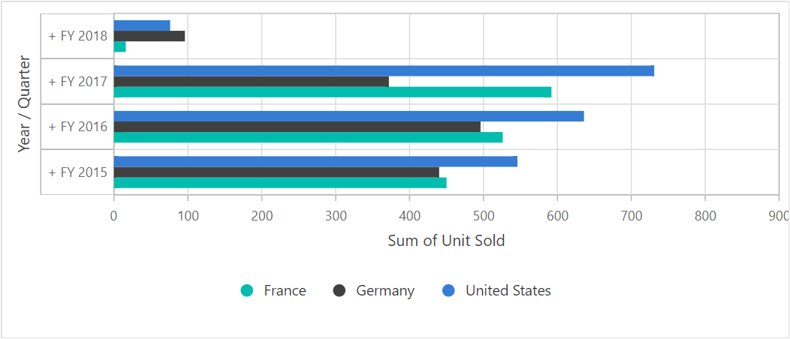

## Accumulation Charts

Supports 4 different types of accumulation charts as follows,

* Pie
* Doughnut
* Funnel
* Pyramid

As like other chart types it can be changed using the property [`Type`](https://help.syncfusion.com/cr/blazor/Syncfusion.Blazor~Syncfusion.Blazor.PivotView.PivotChartSeries~Type.html) in [`PivotChartSeries`](https://help.syncfusion.com/cr/blazor/Syncfusion.Blazor~Syncfusion.Blazor.PivotView.PivotChartSettings~ChartSeries.html) class.

In the below code sample, the **Pie** chart is rendered, and the other accumulation charts can be switched using the drop-down list.

```csharp
@using Syncfusion.Blazor.PivotView
@using Syncfusion.Blazor.DropDowns

<div class="control-section">
    <div id="dropdown-control" style="margin-bottom:5px;">
        <table style="width: 350px;">
            <tbody>
                <tr style="height: 50px">
                    <td>
                        <div>
                            <b>Chart Type:</b>
                        </div>
                    </td>
                    <td>
                        <div>
                            <SfDropDownList TValue="string" TItem="DropDownData" Index=0 DataSource="@ChartTypes">
                                <DropDownListEvents TValue="string" ValueChange="OnChartTypeChange"></DropDownListEvents>
                                <DropDownListFieldSettings Text="Name" Value="Value"></DropDownListFieldSettings>
                            </SfDropDownList>
                        </div>
                    </td>
                </tr>
            </tbody>
        </table>
    </div>
    <div class="content-wrapper">
        <SfPivotView TValue="ProductDetails">
            <PivotViewDataSourceSettings DataSource="@data" ExpandAll=false EnableSorting=true>
                <PivotViewColumns>
                    <PivotViewColumn Name="Country"></PivotViewColumn>
                    <PivotViewColumn Name="Products"></PivotViewColumn>
                </PivotViewColumns>
                <PivotViewRows>
                    <PivotViewRow Name="Year"></PivotViewRow>
                    <PivotViewRow Name="Quarter"></PivotViewRow>
                </PivotViewRows>
                <PivotViewValues>
                    <PivotViewValue Name="Amount" Caption="Sales Amount"></PivotViewValue>
                </PivotViewValues>
                <PivotViewFormatSettings>
                    <PivotViewFormatSetting Name="Amount" Format="C" UseGrouping=true></PivotViewFormatSetting>
                </PivotViewFormatSettings>
            </PivotViewDataSourceSettings>
            <PivotViewDisplayOption View=View.Chart></PivotViewDisplayOption>
            <PivotChartSettings Title="Sales Analysis">
                <PivotChartSeries Type="@ChartType"></PivotChartSeries>
            </PivotChartSettings>
        </SfPivotView>
    </div>
</div>

@code{
    public ChartSeriesType ChartType = ChartSeriesType.Pie;
    public List<ProductDetails> data { get; set; }
    protected override void OnInitialized()
    {
        this.data = ProductDetails.GetProductData().ToList();
        //Bind the data source collection here. Refer "Assigning sample data to the pivot table" section in getting started for more details.
    }

    public void OnChartTypeChange(@Syncfusion.Blazor.DropDowns.ChangeEventArgs<string> args)
    {
        this.ChartType = (ChartSeriesType)Enum.Parse(typeof(ChartSeriesType), args.Value, true);
    }
    List<DropDownData> ChartTypes = new List<DropDownData>() {
        new DropDownData { Name = "Pie", Value = "Pie" },
        new DropDownData { Name = "Doughnut", Value = "Doughnut" },
        new DropDownData { Name = "Funnel", Value = "Funnel" },
        new DropDownData { Name = "Pyramid", Value = "Pyramid" }
    };
    public class DropDownData
    {
        public string Name { get; set; }
        public string Value { get; set; }
    }
}

```

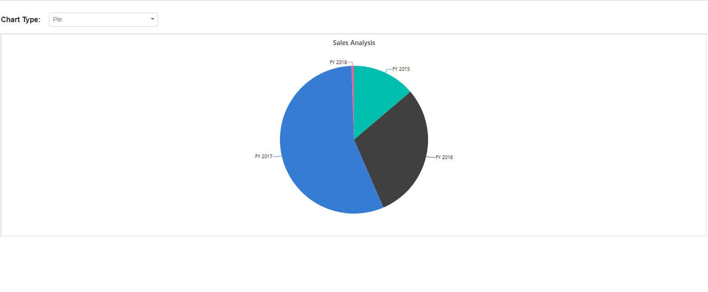

### Drill Down/Up

In the accumulation charts, drill down and drill up operations can be performed using the built-in context menu option. It will be shown while clicking on the chart series. The context menu has the following options:
**Expand** - It is to drill down the corresponding series until the last level.
**Collapse** - It is to drill up the corresponding series until the first level.
**Exit** - It is to close the context menu.

> The drill operation in accumulation charts can be performed only for row headers.

```csharp
@using Syncfusion.Blazor.PivotView

<SfPivotView TValue="ProductDetails">
    <PivotViewDataSourceSettings DataSource="@data" ExpandAll=false EnableSorting=true>
        <PivotViewColumns>
            <PivotViewColumn Name="Products"></PivotViewColumn>
        </PivotViewColumns>
        <PivotViewRows>
            <PivotViewRow Name="Country"></PivotViewRow>
            <PivotViewRow Name="Quarter"></PivotViewRow>
            <PivotViewRow Name="Year"></PivotViewRow>
        </PivotViewRows>
        <PivotViewValues>
            <PivotViewValue Name="Amount" Caption="Sales Amount"></PivotViewValue>
        </PivotViewValues>
        <PivotViewFormatSettings>
            <PivotViewFormatSetting Name="Amount" Format="C" UseGrouping=true></PivotViewFormatSetting>
        </PivotViewFormatSettings>
    </PivotViewDataSourceSettings>
    <PivotViewDisplayOption View=View.Chart></PivotViewDisplayOption>
    <PivotChartSettings Title="Sales Analysis">
        <PivotChartSeries Type="@ChartType">
        </PivotChartSeries>
    </PivotChartSettings>
</SfPivotView>

@code{

    public ChartSeriesType ChartType = ChartSeriesType.Pie;

    public List<ProductDetails> data { get; set; }
    protected override void OnInitialized()
    {
        this.data = ProductDetails.GetProductData().ToList();
        //Bind the data source collection here. Refer "Assigning sample data to the pivot table" section in getting started for more details.
    }
}

```


### Column Headers and Delimiters

Unlike other chart types, the accumulation charts consider the values of a single column from the pivot table to be drawn. Preferably the first column of the pivot table is considered by default. But it can be changed by defining the column headers using the `ColumnHeader` property in [`PivotChartSettings`](https://help.syncfusion.com/cr/blazor/Syncfusion.Blazor~Syncfusion.Blazor.PivotView.PivotChartSettings.html) class.

If the column has more than one header, then need to mention all the headers separated by the delimiter **-**, for example,**Germany-Road Bikes**. Using the property `ColumnDelimiter` in [`PivotChartSettings`](https://help.syncfusion.com/cr/blazor/Syncfusion.Blazor~Syncfusion.Blazor.PivotView.PivotChartSettings.html) class, one can set the desired delimiter to separate the column headers.

```csharp
@using Syncfusion.Blazor.PivotView

<SfPivotView TValue="ProductDetails">
    <PivotViewDataSourceSettings DataSource="@data" ExpandAll=false EnableSorting=true>
        <PivotViewColumns>
            <PivotViewColumn Name="Country"></PivotViewColumn>
            <PivotViewColumn Name="Products"></PivotViewColumn>
        </PivotViewColumns>
        <PivotViewRows>
            <PivotViewRow Name="Year"></PivotViewRow>
            <PivotViewRow Name="Quarter"></PivotViewRow>
        </PivotViewRows>
        <PivotViewValues>
            <PivotViewValue Name="Amount" Caption="Sales Amount"></PivotViewValue>
        </PivotViewValues>
        <PivotViewFormatSettings>
            <PivotViewFormatSetting Name="Amount" Format="C" UseGrouping=true></PivotViewFormatSetting>
        </PivotViewFormatSettings>
        <PivotViewDrilledMembers>
            <PivotViewDrilledMember Name="Country" Items="@(new string[] { "Germany" })"></PivotViewDrilledMember>
        </PivotViewDrilledMembers>
    </PivotViewDataSourceSettings>
    <PivotViewDisplayOption View=View.Chart></PivotViewDisplayOption>
    <PivotChartSettings Title="Sales Analysis" ColumnHeader="Germany-Road Bikes" ColumnDelimiter="-">
        <PivotChartSeries Type="@ChartType"></PivotChartSeries>
    </PivotChartSettings>
</SfPivotView>

@code{

    public ChartSeriesType ChartType = ChartSeriesType.Doughnut;

    public List<ProductDetails> data { get; set; }
    protected override void OnInitialized()
    {
        this.data = ProductDetails.GetProductData().ToList();
        //Bind the data source collection here. Refer "Assigning sample data to the pivot table" section in getting started for more details.
    }

}
```


### Label Customization

The data labels are visible by default showing header name. Its visibility can be modified using the `Visible` boolean property in `DataLabel` Tag. With regard to the label arrangement, the **Smart Labels** options help to arrange labels efficiently without overlapping. It can be disabled by setting the `EnableSmartLabels` property in [`PivotChartSettings`](https://help.syncfusion.com/cr/blazor/Syncfusion.Blazor~Syncfusion.Blazor.PivotView.PivotChartSettings.html) class as **false**.
The `position` property in `dataLabel` allows to specify the position of the data label. The available options are,
* `Outside`: Positions the label outside the point. It is the default option.
* `Inside`: Positions the label inside the point.

In the following code sample, the data labels are placed inside.

```csharp
@using Syncfusion.Blazor.PivotView

<SfPivotView TValue="ProductDetails">
    <PivotViewDataSourceSettings DataSource="@data" ExpandAll=false EnableSorting=true>
        <PivotViewColumns>
            <PivotViewColumn Name="Year"></PivotViewColumn>
            <PivotViewColumn Name="Products"></PivotViewColumn>
        </PivotViewColumns>
        <PivotViewRows>
            <PivotViewRow Name="Country"></PivotViewRow>
            <PivotViewRow Name="Quarter"></PivotViewRow>
        </PivotViewRows>
        <PivotViewValues>
            <PivotViewValue Name="Amount" Caption="Sales Amount"></PivotViewValue>
        </PivotViewValues>
        <PivotViewFormatSettings>
            <PivotViewFormatSetting Name="Amount" Format="C" UseGrouping=true></PivotViewFormatSetting>
        </PivotViewFormatSettings>
    </PivotViewDataSourceSettings>
    <PivotViewDisplayOption View=View.Chart></PivotViewDisplayOption>
    <PivotChartSettings Title="Sales Analysis" EnableSmartLabels="false">
        <PivotChartSeries Type="@ChartType">
            <PivotChartDataLabel Position="@Position"></PivotChartDataLabel>
        </PivotChartSeries>
    </PivotChartSettings>
</SfPivotView>

@code{

    public ChartSeriesType ChartType = ChartSeriesType.Pyramid;
    public PivotChartLabelPosition Position = PivotChartLabelPosition.Inside;
    public List<ProductDetails> data { get; set; }
    protected override void OnInitialized()
    {
        this.data = ProductDetails.GetProductData().ToList();
        //Bind the data source collection here. Refer "Assigning sample data to the pivot table" section in getting started for more details.
    }
}

```


The **Connector Line** will be visible when the data label is placed outside the chart. It can be customized using the `ConnectorStyle` property in `PivotChartDataLabel` class for its color, length, width etc. In the following code sample, the connector line is customized.

```csharp
@using Syncfusion.Blazor.PivotView

<SfPivotView TValue="ProductDetails">
    <PivotViewDataSourceSettings DataSource="@data" ExpandAll=false EnableSorting=true>
        <PivotViewColumns>
            <PivotViewColumn Name="Year"></PivotViewColumn>
            <PivotViewColumn Name="Products"></PivotViewColumn>
        </PivotViewColumns>
        <PivotViewRows>
            <PivotViewRow Name="Country"></PivotViewRow>
            <PivotViewRow Name="Quarter"></PivotViewRow>
        </PivotViewRows>
        <PivotViewValues>
            <PivotViewValue Name="Amount" Caption="Sales Amount"></PivotViewValue>
        </PivotViewValues>
        <PivotViewFormatSettings>
            <PivotViewFormatSetting Name="Amount" Format="C" UseGrouping=true></PivotViewFormatSetting>
        </PivotViewFormatSettings>
    </PivotViewDataSourceSettings>
    <PivotViewDisplayOption View=View.Chart></PivotViewDisplayOption>
    <PivotChartSettings Title="Sales Analysis" EnableSmartLabels="true">
        <PivotChartSeries Type="@ChartType">
            <PivotChartDataLabel Position="@Position">
                <PivotChartConnectorStyle Color="#f4429e" Length="50px" Width="2" DashArray="5,3">
                </PivotChartConnectorStyle>
            </PivotChartDataLabel>
        </PivotChartSeries>
    </PivotChartSettings>
</SfPivotView>

@code{

    public ChartSeriesType ChartType = ChartSeriesType.Funnel;
    public List<ProductDetails> data { get; set; }
    protected override void OnInitialized()
    {
        this.data = ProductDetails.GetProductData().ToList();
        //Bind the data source collection here. Refer "Assigning sample data to the pivot table" section in getting started for more details.
    }
}

```

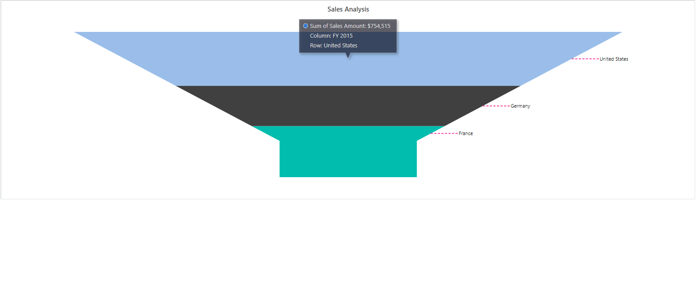

### Pie and Doughnut Customization

User can draw pie and doughnut charts within the specified range using the `StartAngle` and `EndAngle` properties in [`PivotChartSeries`](https://help.syncfusion.com/cr/blazor/Syncfusion.Blazor~Syncfusion.Blazor.PivotView.PivotChartSeries.html) class. The default value of the `StartAngle` property is **0**, and the `EndAngle` property is **360**. By customizing these properties, user can draw semi pie and semi doughnut charts.

```csharp
@using Syncfusion.Blazor.PivotView

<SfPivotView TValue="ProductDetails">
    <PivotViewDataSourceSettings DataSource="@data" ExpandAll=false EnableSorting=true>
        <PivotViewColumns>
            <PivotViewColumn Name="Year"></PivotViewColumn>
            <PivotViewColumn Name="Products"></PivotViewColumn>
        </PivotViewColumns>
        <PivotViewRows>
            <PivotViewRow Name="Country"></PivotViewRow>
            <PivotViewRow Name="Quarter"></PivotViewRow>
        </PivotViewRows>
        <PivotViewValues>
            <PivotViewValue Name="Amount" Caption="Sales Amount"></PivotViewValue>
        </PivotViewValues>
        <PivotViewFormatSettings>
            <PivotViewFormatSetting Name="Amount" Format="C" UseGrouping=true></PivotViewFormatSetting>
        </PivotViewFormatSettings>
    </PivotViewDataSourceSettings>
    <PivotViewDisplayOption View=View.Chart></PivotViewDisplayOption>
    <PivotChartSettings Title="Sales Analysis">
        <PivotChartSeries Type="@ChartType" StartAngle="270" EndAngle="90"></PivotChartSeries>
    </PivotChartSettings>
</SfPivotView>

@code{

    public ChartSeriesType ChartType = ChartSeriesType.Doughnut;
    public List<ProductDetails> data { get; set; }
    protected override void OnInitialized()
    {
        this.data = ProductDetails.GetProductData().ToList();
        //Bind the data source collection here. Refer "Assigning sample data to the pivot table" section in getting started for more details.
    }
}

```

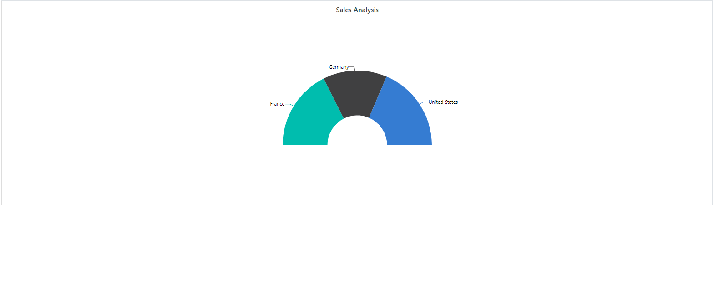

Users can get doughnut chart from pie chart and vice-versa using the `InnerRadius` property in [`PivotChartSeries`](https://help.syncfusion.com/cr/blazor/Syncfusion.Blazor~Syncfusion.Blazor.PivotView.PivotChartSeries.html) class. If the property is greater than **0** percent, the doughnut chart will appear from the pie chart.
> It takes the value only in percentage.

```csharp
@using Syncfusion.Blazor.PivotView

<SfPivotView TValue="ProductDetails">
    <PivotViewDataSourceSettings DataSource="@data" ExpandAll=false EnableSorting=true>
        <PivotViewColumns>
            <PivotViewColumn Name="Year"></PivotViewColumn>
            <PivotViewColumn Name="Products"></PivotViewColumn>
        </PivotViewColumns>
        <PivotViewRows>
            <PivotViewRow Name="Country"></PivotViewRow>
            <PivotViewRow Name="Quarter"></PivotViewRow>
        </PivotViewRows>
        <PivotViewValues>
            <PivotViewValue Name="Amount" Caption="Sales Amount"></PivotViewValue>
        </PivotViewValues>
        <PivotViewFormatSettings>
            <PivotViewFormatSetting Name="Amount" Format="C" UseGrouping=true></PivotViewFormatSetting>
        </PivotViewFormatSettings>
    </PivotViewDataSourceSettings>
    <PivotViewDisplayOption View=View.Chart></PivotViewDisplayOption>
    <PivotChartSettings Title="Sales Analysis">
        <PivotChartSeries Type="@ChartType" InnerRadius="140">
        </PivotChartSeries>
    </PivotChartSettings>
</SfPivotView>

@code{

    public ChartSeriesType ChartType = ChartSeriesType.Pie;
    public List<ProductDetails> data { get; set; }
    protected override void OnInitialized()
    {
        this.data = ProductDetails.GetProductData().ToList();
        //Bind the data source collection here. Refer "Assigning sample data to the pivot table" section in getting started for more details.
    }
}

```

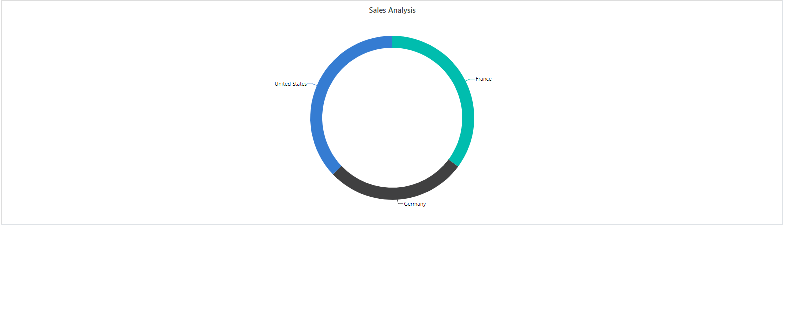

### Exploding Series Points

Exploding can be enabled by setting the `Explode` property in [`PivotChartSeries`](https://help.syncfusion.com/cr/blazor/Syncfusion.Blazor~Syncfusion.Blazor.PivotView.PivotChartSeries.html) class to **true**. The series points will be exploded either on mouse click or touch.

```csharp
@using Syncfusion.Blazor.PivotView

<SfPivotView TValue="ProductDetails">
    <PivotViewDataSourceSettings DataSource="@data" ExpandAll=false EnableSorting=true>
        <PivotViewColumns>
            <PivotViewColumn Name="Year"></PivotViewColumn>
            <PivotViewColumn Name="Products"></PivotViewColumn>
        </PivotViewColumns>
        <PivotViewRows>
            <PivotViewRow Name="Country"></PivotViewRow>
            <PivotViewRow Name="Quarter"></PivotViewRow>
        </PivotViewRows>
        <PivotViewValues>
            <PivotViewValue Name="Amount" Caption="Sales Amount"></PivotViewValue>
        </PivotViewValues>
        <PivotViewFormatSettings>
            <PivotViewFormatSetting Name="Amount" Format="C" UseGrouping=true></PivotViewFormatSetting>
        </PivotViewFormatSettings>
    </PivotViewDataSourceSettings>
    <PivotViewDisplayOption View=View.Chart></PivotViewDisplayOption>
    <PivotChartSettings Title="Sales Analysis">
        <PivotChartSeries Type="@ChartType" Explode="true">
        </PivotChartSeries>
    </PivotChartSettings>
</SfPivotView>

@code{

    public ChartSeriesType ChartType = ChartSeriesType.Pie;
    public List<ProductDetails> data { get; set; }
    protected override void OnInitialized()
    {
        this.data = ProductDetails.GetProductData().ToList();
        //Bind the data source collection here. Refer "Assigning sample data to the pivot table" section in getting started for more details.
    }
}

```

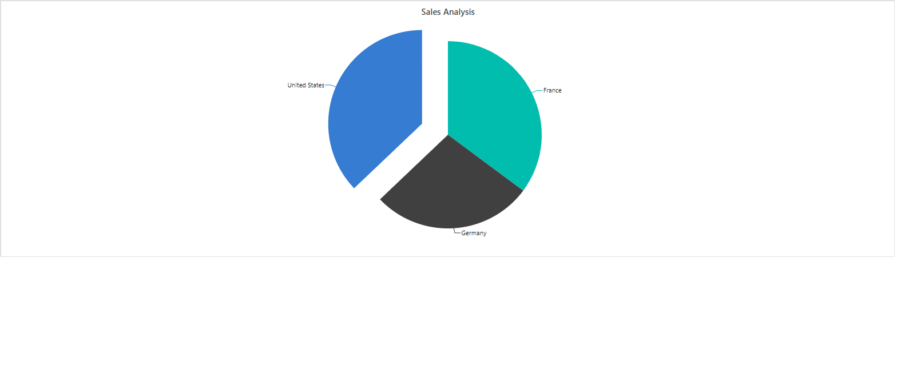

## Field List

User can enable the field list by setting the property [`ShowFieldList`](https://help.syncfusion.com/cr/blazor/Syncfusion.Blazor~Syncfusion.Blazor.PivotView.SfPivotView%601~ShowFieldList.html) in [`SfPivotView`](https://help.syncfusion.com/cr/blazor/Syncfusion.Blazor~Syncfusion.Blazor.PivotView.SfPivotView%601.html) class as **true**.
By using this, user can customize the report dynamically and view the result in pivot chart. For more information regarding the field list, refer the [field list](./field-list) topic.

```csharp
    @using Syncfusion.Blazor.PivotView

    <SfPivotView TValue="ProductDetails" ShowFieldList="true">
         <PivotViewDataSourceSettings DataSource="@data">
            <PivotViewColumns>
                <PivotViewColumn Name="Country"></PivotViewColumn>
                <PivotViewColumn Name="Products"></PivotViewColumn>
            </PivotViewColumns>
            <PivotViewRows>
                <PivotViewRow Name="Year"></PivotViewRow>
                <PivotViewRow Name="Quarter"></PivotViewRow>
            </PivotViewRows>
            <PivotViewValues>
                <PivotViewValue Name="Sold" Caption="Unit Sold"></PivotViewValue>
                <PivotViewValue Name="Amount" Caption="Sold Amount"></PivotViewValue>
            </PivotViewValues>
            <PivotViewFormatSettings>
                <PivotViewFormatSetting Name="Amount" Format="C"></PivotViewFormatSetting>
            </PivotViewFormatSettings>
        </PivotViewDataSourceSettings>
        <PivotViewDisplayOption View=View.Chart></PivotViewDisplayOption>
        <PivotChartSettings Title="Sales Analysis">
            <PivotChartSeries Type=ChartSeriesType.Column></PivotChartSeries>
        </PivotChartSettings>
    </SfPivotView>

    @code{
        public List<ProductDetails> data { get; set; }
        protected override void OnInitialized()
        {
            this.data = ProductDetails.GetProductData().ToList();
           //Bind the data source collection here. Refer "Assigning sample data to the pivot table" section in getting started for more details.
        }
    }

```

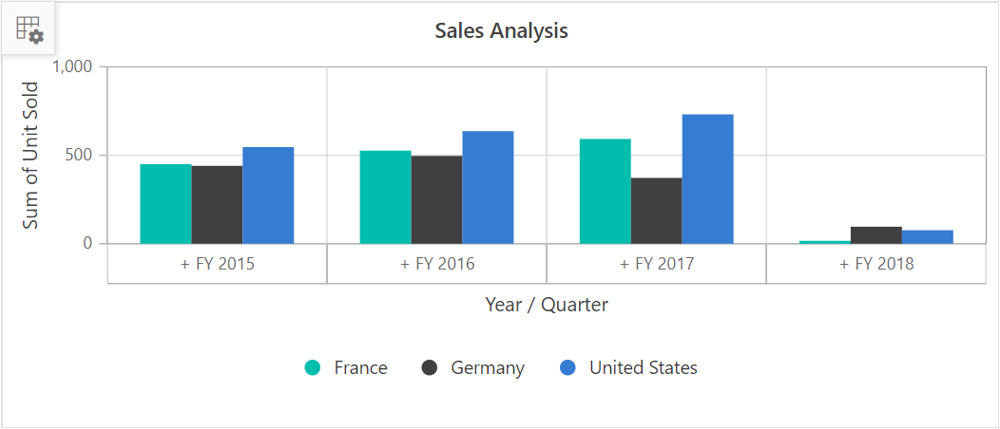

## Grouping Bar

User can enable the grouping bar by setting the property [`ShowGroupingBar`](https://help.syncfusion.com/cr/blazor/Syncfusion.Blazor~Syncfusion.Blazor.PivotView.SfPivotView%601~ShowGroupingBar.html) in [`SfPivotView`](https://help.syncfusion.com/cr/blazor/Syncfusion.Blazor~Syncfusion.Blazor.PivotView.SfPivotView%601.html) class as **true**. The grouping bar in pivot chart shows a dropdown list in value axis instead of buttons. The dropdown list holds list of value fields bounded in the [`PivotViewDataSourceSettings`](https://help.syncfusion.com/cr/blazor/Syncfusion.Blazor~Syncfusion.Blazor.PivotView.DataSourceSettingsModel%601_properties.html) and it can be switched to draw the pivot chart with the selected value field. This has been defined as the default behavior in the pivot chart component. For more information regarding the grouping bar, refer the [grouping bar](./grouping-bar) topic.

> For multiple axis support, buttons will be placed in value axis instead of dropdown list.

```csharp
    @using Syncfusion.Blazor.PivotView

    <SfPivotView TValue="ProductDetails" Width="100%" Height="300" ShowGroupingBar="true">
         <PivotViewDataSourceSettings DataSource="@data">
            <PivotViewColumns>
                <PivotViewColumn Name="Country"></PivotViewColumn>
                <PivotViewColumn Name="Products"></PivotViewColumn>
            </PivotViewColumns>
            <PivotViewRows>
                <PivotViewRow Name="Year"></PivotViewRow>
                <PivotViewRow Name="Quarter"></PivotViewRow>
            </PivotViewRows>
            <PivotViewValues>
                <PivotViewValue Name="Sold" Caption="Unit Sold"></PivotViewValue>
                <PivotViewValue Name="Amount" Caption="Sold Amount"></PivotViewValue>
            </PivotViewValues>
            <PivotViewFormatSettings>
                <PivotViewFormatSetting Name="Amount" Format="C"></PivotViewFormatSetting>
            </PivotViewFormatSettings>
        </PivotViewDataSourceSettings>
        <PivotViewDisplayOption View=View.Chart></PivotViewDisplayOption>
        <PivotChartSettings Title="Sales Analysis">
            <PivotChartSeries Type=ChartSeriesType.Column></PivotChartSeries>
        </PivotChartSettings>
    </SfPivotView>

    @code{
        public List<ProductDetails> data { get; set; }
        protected override void OnInitialized()
        {
            this.data = ProductDetails.GetProductData().ToList();
           //Bind the data source collection here. Refer "Assigning sample data to the pivot table" section in getting started for more details.
        }
    }

```

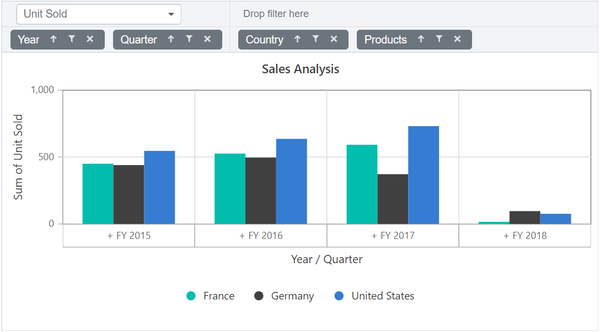

For accumulation charts alone, a drop-down list will be placed in the column axis instead of the buttons. The drop-down list shows the column headers available in the pivot table. Users can dynamically switch column headers with the help of the drop-down list, and the accumulation chart will be updated accordingly.

```csharp
@using Syncfusion.Blazor.PivotView

<SfPivotView TValue="ProductDetails" ShowGroupingBar="true">
    <PivotViewDataSourceSettings DataSource="@data" ExpandAll=false EnableSorting=true>
        <PivotViewColumns>
            <PivotViewColumn Name="Year"></PivotViewColumn>
            <PivotViewColumn Name="Products"></PivotViewColumn>
        </PivotViewColumns>
        <PivotViewRows>
            <PivotViewRow Name="Country"></PivotViewRow>
            <PivotViewRow Name="Quarter"></PivotViewRow>
        </PivotViewRows>
        <PivotViewValues>
            <PivotViewValue Name="Amount" Caption="Sales Amount"></PivotViewValue>
        </PivotViewValues>
        <PivotViewFormatSettings>
            <PivotViewFormatSetting Name="Amount" Format="C" UseGrouping=true></PivotViewFormatSetting>
        </PivotViewFormatSettings>
    </PivotViewDataSourceSettings>
    <PivotViewDisplayOption View=View.Chart></PivotViewDisplayOption>
    <PivotChartSettings Title="Sales Analysis">
        <PivotChartSeries Type="@ChartType">
        </PivotChartSeries>
    </PivotChartSettings>
</SfPivotView>

@code{

    public ChartSeriesType ChartType = ChartSeriesType.Pie;
    public List<ProductDetails> data { get; set; }
    protected override void OnInitialized()
    {
        this.data = ProductDetails.GetProductData().ToList();
        //Bind the data source collection here. Refer "Assigning sample data to the pivot table" section in getting started for more details.
    }
}

```

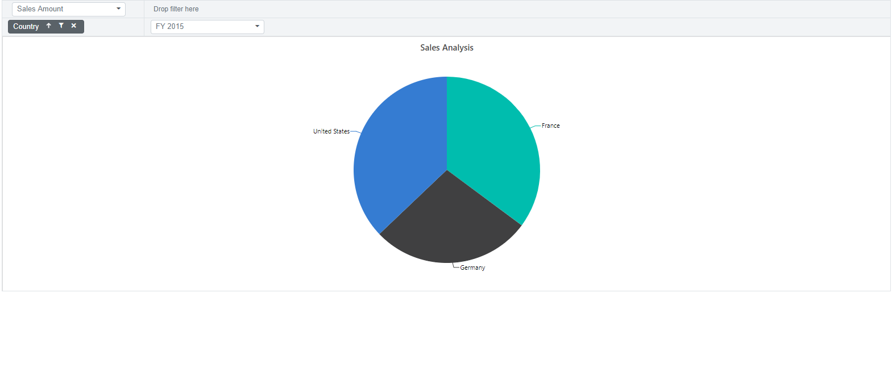

## Single Axis

By default, the pivot chart will be drawn with the value field (measure) which is set first in the report under value axis. But, user can change to specific value field using the property [`Value`](https://help.syncfusion.com/cr/blazor/Syncfusion.Blazor~Syncfusion.Blazor.PivotView.PivotChartSettings~Value.html) in [`PivotChartSettings`](https://help.syncfusion.com/cr/blazor/Syncfusion.Blazor~Syncfusion.Blazor.PivotView.PivotChartSettings_properties.html) class.

```csharp
    @using Syncfusion.Blazor.PivotView

    <SfPivotView TValue="ProductDetails">
    <PivotViewDataSourceSettings DataSource="@data">
            <PivotViewColumns>
                <PivotViewColumn Name="Country"></PivotViewColumn>
                <PivotViewColumn Name="Products"></PivotViewColumn>
            </PivotViewColumns>
            <PivotViewRows>
                <PivotViewRow Name="Year"></PivotViewRow>
                <PivotViewRow Name="Quarter"></PivotViewRow>
            </PivotViewRows>
            <PivotViewValues>
                <PivotViewValue Name="Sold" Caption="Unit Sold"></PivotViewValue>
                <PivotViewValue Name="Amount" Caption="Sold Amount"></PivotViewValue>
            </PivotViewValues>
            <PivotViewFormatSettings>
                <PivotViewFormatSetting Name="Amount" Format="C"></PivotViewFormatSetting>
            </PivotViewFormatSettings>
        </PivotViewDataSourceSettings>
        <PivotViewDisplayOption View=View.Chart></PivotViewDisplayOption>
        <PivotChartSettings Value="Amount" Title="Sales Analysis">
            <PivotChartSeries Type=ChartSeriesType.Column></PivotChartSeries>
        </PivotChartSettings>
    </SfPivotView>

    @code{
        public List<ProductDetails> data { get; set; }
        protected override void OnInitialized()
        {
            this.data = ProductDetails.GetProductData().ToList();
           //Bind the data source collection here. Refer "Assigning sample data to the pivot table" section in getting started for more details.
        }
    }
```

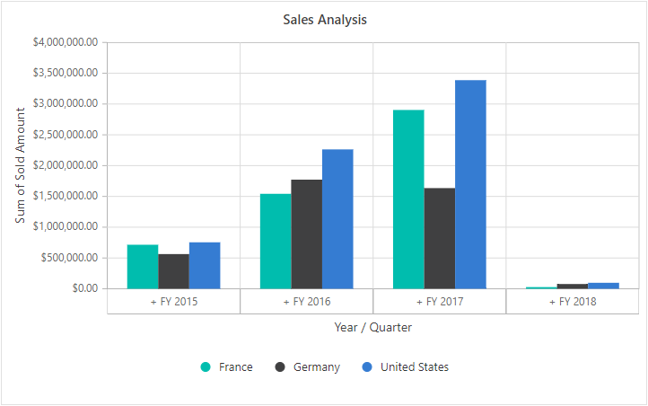

## Multi Axis

User can draw the pivot chart with multiple value fields by setting the property [`EnableMultiAxis`](https://help.syncfusion.com/cr/blazor/Syncfusion.Blazor~Syncfusion.Blazor.PivotView.PivotChartSettings~EnableMultiAxis.html) in [`PivotChartSettings`](https://help.syncfusion.com/cr/blazor/Syncfusion.Blazor~Syncfusion.Blazor.PivotView.PivotChartSettings_properties.html) class as **true**. In the below code sample, the pivot chart will be drawn with both value fields "Sold" and "Amount" available in the [`PivotViewDataSourceSettings`](https://help.syncfusion.com/cr/blazor/Syncfusion.Blazor~Syncfusion.Blazor.PivotView.DataSourceSettingsModel%601_properties.html).

> The multi axis support is not applicable for the accumulation chart types like pie, doughnut, pyramid, and funnel.

```csharp
    @using Syncfusion.Blazor.PivotView

    <SfPivotView TValue="ProductDetails">
    <PivotViewDataSourceSettings DataSource="@data">
            <PivotViewColumns>
                <PivotViewColumn Name="Country"></PivotViewColumn>
                <PivotViewColumn Name="Products"></PivotViewColumn>
            </PivotViewColumns>
            <PivotViewRows>
                <PivotViewRow Name="Year"></PivotViewRow>
                <PivotViewRow Name="Quarter"></PivotViewRow>
            </PivotViewRows>
            <PivotViewValues>
                <PivotViewValue Name="Sold" Caption="Unit Sold"></PivotViewValue>
                <PivotViewValue Name="Amount" Caption="Sold Amount"></PivotViewValue>
            </PivotViewValues>
        </PivotViewDataSourceSettings>
        <PivotViewDisplayOption View=View.Chart></PivotViewDisplayOption>
            <PivotChartSettings EnableMultiAxis="true"></PivotChartSettings>
    </SfPivotView>

    @code{
        public List<ProductDetails> data { get; set; }
        protected override void OnInitialized()
        {
            this.data = ProductDetails.GetProductData().ToList();
           //Bind the data source collection here. Refer "Assigning sample data to the pivot table" section in getting started for more details.
        }
    }
```

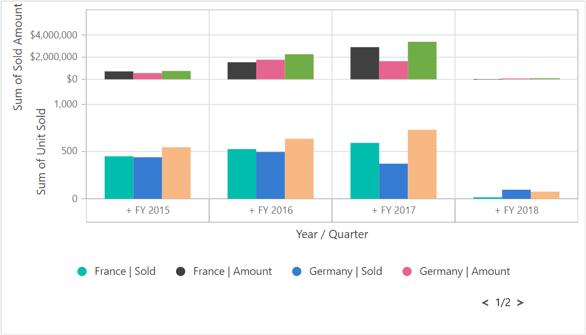

If the user binds more value fields, the result will be multiple pivot charts, and each chart will shrink within the parent container height. To avoid this, set the [`EnableScrollOnMultiAxis`](https://help.syncfusion.com/cr/blazor/Syncfusion.Blazor~Syncfusion.Blazor.PivotView.PivotChartSettings~EnableScrollOnMultiAxis.html) property in [`PivotChartSettings`](https://help.syncfusion.com/cr/blazor/Syncfusion.Blazor~Syncfusion.Blazor.PivotView.PivotChartSettings_properties.html) to **true**. By doing so, each pivot chart will only shrink to a minimal "160px" – "180px" height showing a vertical scrollbar for a clear view.

```csharp
    @using Syncfusion.Blazor.PivotView

    <SfPivotView TValue="ProductDetails">
    <PivotViewDataSourceSettings DataSource="@data">
            <PivotViewColumns>
                <PivotViewColumn Name="Country"></PivotViewColumn>
            <PivotViewRows>
                <PivotViewRow Name="Year"></PivotViewRow>
                <PivotViewRow Name="Quarter"></PivotViewRow>
            </PivotViewRows>
            <PivotViewValues>
                <PivotViewValue Name="Sold" Caption="Unit Sold"></PivotViewValue>
                <PivotViewValue Name="Amount" Caption="Sold Amount"></PivotViewValue>
                <PivotViewColumn Name="Products" Type="Count"></PivotViewColumn>
            </PivotViewColumns>
            </PivotViewValues>
        </PivotViewDataSourceSettings>
        <PivotViewDisplayOption View=View.Chart></PivotViewDisplayOption>
            <PivotChartSettings EnableMultiAxis="true" EnableScrollOnMultiAxis="true"></PivotChartSettings>
    </SfPivotView>

    @code{
        public List<ProductDetails> data { get; set; }
        protected override void OnInitialized()
        {
            this.data = ProductDetails.GetProductData().ToList();
           //Bind the data source collection here. Refer "Assigning sample data to the pivot table" section in getting started for more details.
        }
    }
```

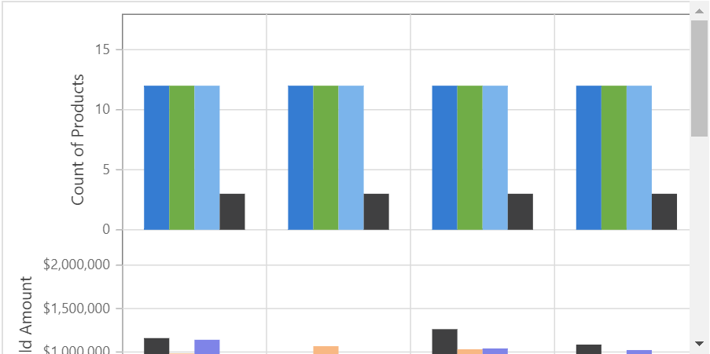

## Series Customization

User can customize series of the pivot chart using [`PivotChartSeries`](https://help.syncfusion.com/cr/blazor/Syncfusion.Blazor~Syncfusion.Blazor.PivotView.PivotChartSettings~ChartSeries.html) in [`PivotChartSettings`](https://help.syncfusion.com/cr/blazor/Syncfusion.Blazor~Syncfusion.Blazor.PivotView.PivotChartSettings_properties.html) class. The changes handled in the property will be reflected commonly in all chart series.

```csharp
    @using Syncfusion.Blazor.PivotView

    <SfPivotView TValue="ProductDetails">
        <PivotViewDisplayOption View=View.Chart></PivotViewDisplayOption>
        <PivotViewDataSourceSettings DataSource="@data">
            <PivotViewColumns>
                <PivotViewColumn Name="Country"></PivotViewColumn>
                <PivotViewColumn Name="Products"></PivotViewColumn>
            </PivotViewColumns>
            <PivotViewRows>
                <PivotViewRow Name="Year"></PivotViewRow>
                <PivotViewRow Name="Quarter"></PivotViewRow>
            </PivotViewRows>
            <PivotViewValues>
               <PivotViewValue Name="Sold" Caption="Unit Sold"></PivotViewValue>
            </PivotViewValues>
        </PivotViewDataSourceSettings>
        <PivotViewDisplayOption View=View.Chart></PivotViewDisplayOption>
        <PivotChartSettings Title="Sales Analysis">
            <PivotChartSeries Type=ChartSeriesType.Column>
                <PivotChartSeriesBorder Color="#000" Width=2></PivotChartSeriesBorder>
                // Other major options are:
                // <PivotChartCornerRadius TopLeft=20 TopRight=20 BottomLeft=10 BottomRight=10></PivotChartCornerRadius>
                // <PivotChartSeriesAnimation Enable="true" Duration=500></PivotChartSeriesAnimation>
            </PivotChartSeries>
        </PivotChartSettings>
    </SfPivotView>

    @code{
        public List<ProductDetails> data { get; set; }
        protected override void OnInitialized()
        {
            this.data = ProductDetails.GetProductData().ToList();
           //Bind the data source collection here. Refer "Assigning sample data to the pivot table" section in getting started for more details.
        }
    }

```

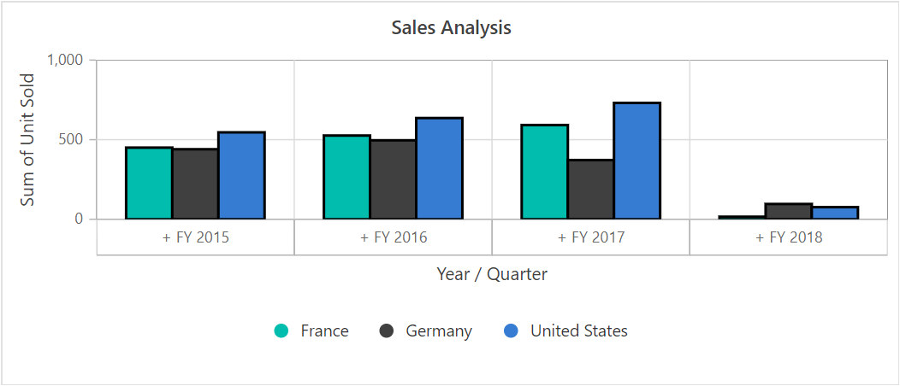

## Axis Customization

User can customize axis of the pivot chart using [`PivotChartPrimaryXAxis`](https://help.syncfusion.com/cr/blazor/Syncfusion.Blazor~Syncfusion.Blazor.PivotView.PivotChartPrimaryXAxis_properties.html) and [`PivotChartPrimaryYAxis`](https://help.syncfusion.com/cr/blazor/Syncfusion.Blazor~Syncfusion.Blazor.PivotView.PivotChartPrimaryYAxis_properties.html) properties in [`PivotChartSettings`](https://help.syncfusion.com/cr/blazor/Syncfusion.Blazor~Syncfusion.Blazor.PivotView.PivotChartSettings_properties.html) class.

> Axis customization is not applicable for the accumulation chart types like pie, doughnut, pyramid, and funnel.

```csharp
    @using Syncfusion.Blazor.PivotView

    <SfPivotView TValue="ProductDetails">
        <PivotViewDataSourceSettings DataSource="@data">
            <PivotViewColumns>
                <PivotViewColumn Name="Country"></PivotViewColumn>
                <PivotViewColumn Name="Products"></PivotViewColumn>
            </PivotViewColumns>
            <PivotViewRows>
                <PivotViewRow Name="Year"></PivotViewRow>
                <PivotViewRow Name="Quarter"></PivotViewRow>
            </PivotViewRows>
            <PivotViewValues>
                <PivotViewValue Name="Sold" Caption="Unit Sold"></PivotViewValue>
            </PivotViewValues>
        </PivotViewDataSourceSettings>
        <PivotViewDisplayOption View=View.Chart></PivotViewDisplayOption>
        <PivotChartSettings Title="Sales Analysis">
            <PivotChartSeries Type=ChartSeriesType.Column></PivotChartSeries>
            <PivotChartPrimaryYAxis Title="Y Axis Title" LabelFormat="P" LabelPosition="PivotChartAxisPosition.Outside">
            </PivotChartPrimaryYAxis>
            <PivotChartPrimaryXAxis Title="X Axis Title" IsInversed="true" LabelPosition="PivotChartAxisPosition.Outside">
            </PivotChartPrimaryXAxis>
        </PivotChartSettings>
    </SfPivotView>

    @code{
        public List<ProductDetails> data { get; set; }
        protected override void OnInitialized()
        {
            this.data = ProductDetails.GetProductData().ToList();
           //Bind the data source collection here. Refer "Assigning sample data to the pivot table" section in getting started for more details.
        }
    }

```

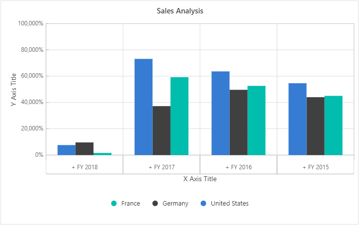

## Legend Customization

User can customize legend using [`PivotChartLegendSettings`](https://help.syncfusion.com/cr/blazor/Syncfusion.Blazor~Syncfusion.Blazor.PivotView.PivotChartLegendSettings_properties.html) in [`PivotChartSettings`](https://help.syncfusion.com/cr/blazor/Syncfusion.Blazor~Syncfusion.Blazor.PivotView.PivotChartSettings_properties.html) class. By default, legend will be visible and it can be hidden by setting the property [`Visible`](https://help.syncfusion.com/cr/blazor/Syncfusion.Blazor~Syncfusion.Blazor.PivotView.PivotChartLegendSettings~Visible.html) in [`PivotChartLegendSettings`](https://help.syncfusion.com/cr/blazor/Syncfusion.Blazor~Syncfusion.Blazor.PivotView.PivotChartLegendSettings_properties.html) class as **false**.

The pivot chart support different types of legend shapes as follows,

* Circle
* Rectangle
* VerticalLine
* Pentagon
* InvertedTriangle
* SeriesType
* Triangle
* Diamond
* Cross
* HorizontalLine

Here [**PivotChartLegendShape.SeriesType**](https://help.syncfusion.com/cr/blazor/Syncfusion.Blazor~Syncfusion.Blazor.PivotView.PivotChartLegendShape.html) would act as the default shape and it can changed using the property [`LegendShape`](https://help.syncfusion.com/cr/blazor/Syncfusion.Blazor~Syncfusion.Blazor.PivotView.PivotChartSeries~LegendShape.html) in [`PivotChartSeries`](https://help.syncfusion.com/cr/blazor/Syncfusion.Blazor~Syncfusion.Blazor.PivotView.PivotChartSeries.html) class.

Also user can set the position of the legend in pivot chart using the property [`Position`](https://help.syncfusion.com/cr/blazor/Syncfusion.Blazor~Syncfusion.Blazor.PivotView.PivotChartLegendSettings~Position.html) in [`PivotChartLegendSettings`](https://help.syncfusion.com/cr/blazor/Syncfusion.Blazor~Syncfusion.Blazor.PivotView.PivotChartLegendSettings.html) class. The available options to set the legend position are as follows,

* Auto: Places the legend based on area type. This is the default.
* Top: Displays the legend at the top of the pivot chart.
* Left: Displays the legend at the left of the pivot chart.
* Bottom: Displays the legend at the bottom of the pivot chart.
* Right: Displays the legend at the right of the pivot chart.
* Custom: Displays the legend based on the given x and y values.

> By default, the legend is not visible for the accumulation chart types like pie, doughnut, pyramid, and funnel.

```csharp
    @using Syncfusion.Blazor.PivotView

    <SfPivotView TValue="ProductDetails">
        <PivotViewDataSourceSettings DataSource="@data">
            <PivotViewColumns>
                <PivotViewColumn Name="Country"></PivotViewColumn>
                <PivotViewColumn Name="Products"></PivotViewColumn>
            </PivotViewColumns>
            <PivotViewRows>
                <PivotViewRow Name="Year"></PivotViewRow>
                <PivotViewRow Name="Quarter"></PivotViewRow>
            </PivotViewRows>
            <PivotViewValues>
                <PivotViewValue Name="Sold" Caption="Unit Sold"></PivotViewValue>
            </PivotViewValues>
        </PivotViewDataSourceSettings>
        <PivotViewDisplayOption View=View.Chart></PivotViewDisplayOption>
        <PivotChartSettings Title="Sales Analysis">
            <PivotChartLegendSettings Position=PivotChartLegendPosition.Right Background="rgb(230, 236, 239)" Padding=20 Alignment="PivotChartAlignment.Center">
            </PivotChartLegendSettings>
            <PivotChartSeries Type=ChartSeriesType.Column LegendShape=PivotChartLegendShape.Pentagon></PivotChartSeries>
        </PivotChartSettings>
    </SfPivotView>

    @code{
        public List<ProductDetails> data { get; set; }
        protected override void OnInitialized()
        {
            this.data = ProductDetails.GetProductData().ToList();
           //Bind the data source collection here. Refer "Assigning sample data to the pivot table" section in getting started for more details.
        }
    }

```

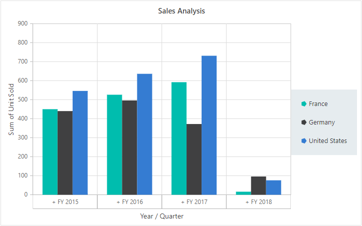

## User Interaction

### Marker and CrossHair

User can enable and customize the marker and crosshair using [`PivotChartMarkerSettings`](https://help.syncfusion.com/cr/blazor/Syncfusion.Blazor~Syncfusion.Blazor.PivotView.PivotChartMarkerSettings_properties.html) and [`PivotChartCrosshairSettings`](https://help.syncfusion.com/cr/blazor/Syncfusion.Blazor~Syncfusion.Blazor.PivotView.PivotChartCrosshairSettings_properties.html) properties in [`PivotChartSettings`](https://help.syncfusion.com/cr/cref_files/blazor/Syncfusion.Blazor~Syncfusion.Blazor.PivotView.PivotChartSettings.html) class respectively.

Also user can enable and customize the crosshair tooltip for axes using [`PivotChartPrimaryXAxisCrosshairTooltip`](https://help.syncfusion.com/cr/blazor/Syncfusion.Blazor~Syncfusion.Blazor.PivotView.PivotChartPrimaryXAxisCrosshairTooltip_properties.html) and [`PivotChartPrimaryYAxisCrosshairTooltip`](https://help.syncfusion.com/cr/blazor/Syncfusion.Blazor~Syncfusion.Blazor.PivotView.PivotChartPrimaryYAxisCrosshairTooltip_properties.html) classes.

> Marker and crosshair is not applicable for the accumulation chart types like pie, doughnut, pyramid, and funnel.

```csharp
    @using Syncfusion.Blazor.PivotView

    <SfPivotView TValue="ProductDetails">
        <PivotViewDataSourceSettings DataSource="@data">
            <PivotViewColumns>
                <PivotViewColumn Name="Country"></PivotViewColumn>
                <PivotViewColumn Name="Products"></PivotViewColumn>
            </PivotViewColumns>
            <PivotViewRows>
                <PivotViewRow Name="Year"></PivotViewRow>
                <PivotViewRow Name="Quarter"></PivotViewRow>
            </PivotViewRows>
            <PivotViewValues>
                <PivotViewValue Name="Sold" Caption="Unit Sold"></PivotViewValue>
            </PivotViewValues>
        </PivotViewDataSourceSettings>
        <PivotViewDisplayOption View=View.Chart></PivotViewDisplayOption>
           <PivotChartSettings>
            <PivotChartCrosshairSettings Enable="true"></PivotChartCrosshairSettings>
            <PivotChartSeries Type=ChartSeriesType.Line>
                <PivotChartMarkerSettings Fill="#EEE" Height=10 Width=10 Visible="true" Shape=PivotChartShape.Pentagon></PivotChartMarkerSettings>
            </PivotChartSeries>
            <PivotChartPrimaryXAxis>
                <PivotChartPrimaryXAxisCrosshairTooltip Enable="true" Fill="#ff0000"></PivotChartPrimaryXAxisCrosshairTooltip>
            </PivotChartPrimaryXAxis>
            <PivotChartPrimaryYAxis>
                <PivotChartPrimaryYAxisCrosshairTooltip Enable="true" Fill="#0000FF"></PivotChartPrimaryYAxisCrosshairTooltip>
            </PivotChartPrimaryYAxis>
        </PivotChartSettings>
    </SfPivotView>

    @code{
        public List<ProductDetails> data { get; set; }
        protected override void OnInitialized()
        {
            this.data = ProductDetails.GetProductData().ToList();
           //Bind the data source collection here. Refer "Assigning sample data to the pivot table" section in getting started for more details.
        }
    }

```

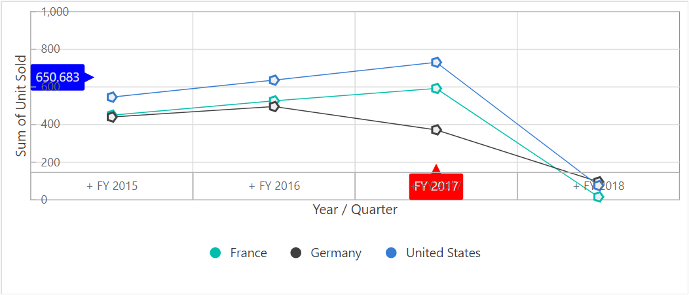

### Zooming and Panning

User can customize zooming and panning option using the property [`PivotChartZoomSettings`](https://help.syncfusion.com/cr/blazor/Syncfusion.Blazor~Syncfusion.Blazor.PivotView.PivotChartZoomSettings_properties.html) in [`PivotChartSettings`](https://help.syncfusion.com/cr/cref_files/blazor/Syncfusion.Blazor~Syncfusion.Blazor.PivotView.PivotChartSettings.html) class.

The pivot chart support four types of zooming which can be set as follows,

* [`EnablePinchZooming`](https://help.syncfusion.com/cr/blazor/Syncfusion.Blazor~Syncfusion.Blazor.PivotView.PivotChartZoomSettings~EnablePinchZooming.html)
* [`EnableSelectionZooming`](https://help.syncfusion.com/cr/blazor/Syncfusion.Blazor~Syncfusion.Blazor.PivotView.PivotChartZoomSettings~EnableSelectionZooming.html)
* [`EnableDeferredZooming`](https://help.syncfusion.com/cr/blazor/Syncfusion.Blazor~Syncfusion.Blazor.PivotView.PivotChartZoomSettings~EnableDeferredZooming.html)
* [`EnableMouseWheelZooming`](https://help.syncfusion.com/cr/blazor/Syncfusion.Blazor~Syncfusion.Blazor.PivotView.PivotChartZoomSettings~EnableMouseWheelZooming.html)

and three modes of zooming direction that specifies whether to zoom vertically or horizontally or in both ways which are,

* x: Pivot chart can be zoomed horizontally.
* y: Pivot chart can be zoomed  vertically.
* x,y: Pivot chart can be zoomed both vertically and horizontally.

This can be set using the property [`Mode`](https://help.syncfusion.com/cr/blazor/Syncfusion.Blazor~Syncfusion.Blazor.PivotView.PivotChartZoomSettings~Mode.html) in [`PivotChartZoomSettings`](https://help.syncfusion.com/cr/blazor/Syncfusion.Blazor~Syncfusion.Blazor.PivotView.PivotChartZoomSettings.html) class. By default, if the pivot chart is zoomed, a toolbar would display with the options - Zoom, ZoomIn, ZoomOut, Pan, Reset. User can also customize its option using the property [`ToolbarItems`](https://help.syncfusion.com/cr/blazor/Syncfusion.Blazor~Syncfusion.Blazor.PivotView.PivotChartZoomSettings~ToolbarItems.html) in [`PivotChartZoomSettings`](https://help.syncfusion.com/cr/blazor/Syncfusion.Blazor~Syncfusion.Blazor.PivotView.PivotChartZoomSettings~ToolbarItems.html) class.

> Zooming and panning is not applicable for the accumulation chart types like pie, doughnut, pyramid, and funnel.

```csharp
    @using Syncfusion.Blazor.PivotView

    <SfPivotView TValue="ProductDetails">
        <PivotViewDataSourceSettings DataSource="@data">
            <PivotViewColumns>
                <PivotViewColumn Name="Country"></PivotViewColumn>
                <PivotViewColumn Name="Products"></PivotViewColumn>
            </PivotViewColumns>
            <PivotViewRows>
                <PivotViewRow Name="Year"></PivotViewRow>
                <PivotViewRow Name="Quarter"></PivotViewRow>
            </PivotViewRows>
            <PivotViewValues>
                <PivotViewValue Name="Sold" Caption="Unit Sold"></PivotViewValue>
            </PivotViewValues>
        </PivotViewDataSourceSettings>
        <PivotViewDisplayOption View=View.Chart></PivotViewDisplayOption>
        <PivotChartSettings Title="Sales Analysis">
            <PivotChartSeries Type=ChartSeriesType.Column></PivotChartSeries>
            <PivotChartZoomSettings ToolbarItems=@toolbar EnableDeferredZooming="true" EnableMouseWheelZooming="true" EnablePinchZooming="true" EnableSelectionZooming="true">
            </PivotChartZoomSettings>
        </PivotChartSettings>
    </SfPivotView>

    @code{
        public List<PivotChartToolbarItems> toolbar = new List<PivotChartToolbarItems> {
            PivotChartToolbarItems.Zoom,
            PivotChartToolbarItems.ZoomIn,
            PivotChartToolbarItems.ZoomOut,
            PivotChartToolbarItems.Pan,
            PivotChartToolbarItems.Reset
        };
        public List<ProductDetails> data { get; set; }
        protected override void OnInitialized()
        {
            this.data = ProductDetails.GetProductData().ToList();
           //Bind the data source collection here. Refer "Assigning sample data to the pivot table" section in getting started for more details.
        }
    }

```

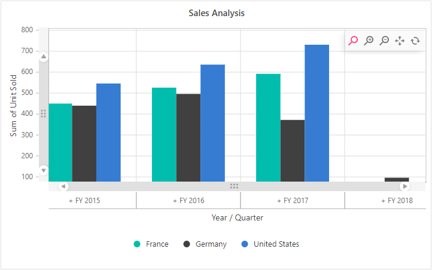

### Tooltip

By default, tooltip for the pivot chart is enabled. User can customize it by using the property [`PivotChartTooltipSettings`](https://help.syncfusion.com/cr/blazor/Syncfusion.Blazor~Syncfusion.Blazor.PivotView.PivotChartTooltipSettings_properties.html) in [`PivotChartSettings`](https://help.syncfusion.com/cr/cref_files/blazor/Syncfusion.Blazor~Syncfusion.Blazor.PivotView.PivotChartSettings.html) class.

> The tooltip can be disabled by setting the property [`Enable`](https://help.syncfusion.com/cr/cref_files/blazor/Syncfusion.Blazor~Syncfusion.Blazor.PivotView.PivotChartTooltipSettings~Enable.html) in [`PivotChartTooltipSettings`](https://help.syncfusion.com/cr/blazor/Syncfusion.Blazor~Syncfusion.Blazor.PivotView.PivotChartTooltipSettings_properties.html) class as **false**.

```csharp
    @using Syncfusion.Blazor.PivotView

    <SfPivotView TValue="ProductDetails">
        <PivotViewDataSourceSettings DataSource="@data">
           <PivotViewColumns>
                <PivotViewColumn Name="Country"></PivotViewColumn>
                <PivotViewColumn Name="Products"></PivotViewColumn>
            </PivotViewColumns>
            <PivotViewRows>
                <PivotViewRow Name="Year"></PivotViewRow>
                <PivotViewRow Name="Quarter"></PivotViewRow>
            </PivotViewRows>
            <PivotViewValues>
                <PivotViewValue Name="Sold" Caption="Unit Sold"></PivotViewValue>
            </PivotViewValues>
        </PivotViewDataSourceSettings>
        <PivotViewDisplayOption View=View.Chart></PivotViewDisplayOption>
        <PivotChartSettings Title="Sales Analysis">
            <PivotChartSeries Type=ChartSeriesType.Column></PivotChartSeries>
            <PivotChartTooltipSettings header="Tooltip Header" EnableAnimation="true" EnableMarker="true" Fill="black" Opacity=1>
                <PivotChartTooltipTextStyle Color="#FFF" FontStyle="Italic" FontWeight=600></PivotChartTooltipTextStyle>
            </PivotChartTooltipSettings>
        </PivotChartSettings>
    </SfPivotView>

    @code{
        public List<ProductDetails> data { get; set; }
        protected override void OnInitialized()
        {
            this.data = ProductDetails.GetProductData().ToList();
           //Bind the data source collection here. Refer "Assigning sample data to the pivot table" section in getting started for more details.
        }
    }

```

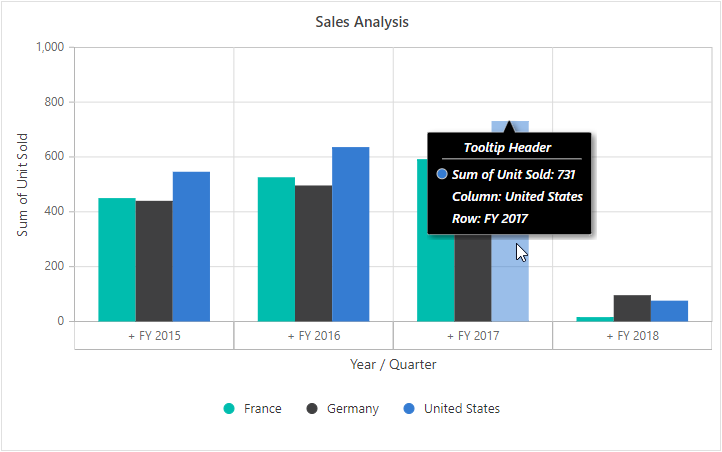

## Export

The pivot chart can be exported using the [`ChartExport`](https://help.syncfusion.com/cr/cref_files/blazor/Syncfusion.Blazor~Syncfusion.Blazor.PivotView.SfPivotView%601~ChartExport.html) method which holds parameters like export type, file name, PDF orientation, width, and height in the same order. The mandatory parameters for this method are export type and file name whereas other parameters are optional.

The following are the four export types:

* PNG
* JPEG
* SVG
* PDF

In the following code sample, exporting can be done using an external button named as "Chart Export".

```csharp
    @using Syncfusion.Blazor.PivotView
    @using Syncfusion.Blazor.Buttons

    <SfButton OnClick="OnChartExport" Content="Chart Export"></SfButton>
    <SfPivotView TValue="ProductDetails" @ref="@pivot" ShowFieldList="true">
         <PivotViewDataSourceSettings DataSource="@data">
            <PivotViewColumns>
                <PivotViewColumn Name="Country"></PivotViewColumn>
                <PivotViewColumn Name="Products"></PivotViewColumn>
            </PivotViewColumns>
            <PivotViewRows>
                <PivotViewRow Name="Year"></PivotViewRow>
                <PivotViewRow Name="Quarter"></PivotViewRow>
            </PivotViewRows>
            <PivotViewValues>
                <PivotViewValue Name="Sold" Caption="Unit Sold"></PivotViewValue>
                <PivotViewValue Name="Amount" Caption="Sold Amount"></PivotViewValue>
            </PivotViewValues>
            <PivotViewFormatSettings>
                <PivotViewFormatSetting Name="Amount" Format="C"></PivotViewFormatSetting>
            </PivotViewFormatSettings>
        </PivotViewDataSourceSettings>
        <PivotViewDisplayOption View=View.Chart></PivotViewDisplayOption>
        <PivotChartSettings Title="Sales Analysis">
            <PivotChartSeries Type=ChartSeriesType.Column></PivotChartSeries>
        </PivotChartSettings>
    </SfPivotView>

    @code{
        SfPivotView pivot;
        public List<ProductDetails> data { get; set; }
        protected override void OnInitialized()
        {
            this.data = ProductDetails.GetProductData().ToList();
           //Bind the data source collection here. Refer "Assigning sample data to the pivot table" section in getting started for more details.
        }
        public void OnChartExport()
        {
            this.pivot.ChartExport("PDF", "sample", "Landscape");
            //To export pivot chart to JPEG, SVG or PNG image formats, change the export type from "PDF" to JPEG, SVG or PNG.
            //this.pivot.ChartExport("JPEG", "sample");
        }
    }

```

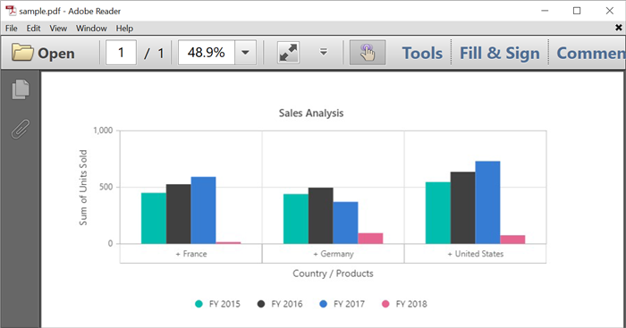

## Print

The rendered pivot chart can be printed directly from the browser by calling [`PrintChart`](https://help.syncfusion.com/cr/cref_files/blazor/Syncfusion.Blazor~Syncfusion.Blazor.PivotView.SfPivotView%601~PrintChart.html) method.

In the following code sample, printing can be done using an external button named as "Print Chart".

```csharp
    @using Syncfusion.Blazor.PivotView
    @using Syncfusion.Blazor.Buttons

    <SfButton OnClick="OnPrintChart" Content="Print Chart"></SfButton>
    <SfPivotView TValue="ProductDetails" @ref="@pivot" ShowFieldList="true">
         <PivotViewDataSourceSettings DataSource="@data">
            <PivotViewColumns>
                <PivotViewColumn Name="Country"></PivotViewColumn>
                <PivotViewColumn Name="Products"></PivotViewColumn>
            </PivotViewColumns>
            <PivotViewRows>
                <PivotViewRow Name="Year"></PivotViewRow>
                <PivotViewRow Name="Quarter"></PivotViewRow>
            </PivotViewRows>
            <PivotViewValues>
                <PivotViewValue Name="Sold" Caption="Unit Sold"></PivotViewValue>
                <PivotViewValue Name="Amount" Caption="Sold Amount"></PivotViewValue>
            </PivotViewValues>
            <PivotViewFormatSettings>
                <PivotViewFormatSetting Name="Amount" Format="C"></PivotViewFormatSetting>
            </PivotViewFormatSettings>
        </PivotViewDataSourceSettings>
        <PivotViewDisplayOption View=View.Chart></PivotViewDisplayOption>
        <PivotChartSettings Title="Sales Analysis">
            <PivotChartSeries Type=ChartSeriesType.Column></PivotChartSeries>
        </PivotChartSettings>
    </SfPivotView>

    @code{
        SfPivotView pivot;
        public List<ProductDetails> data { get; set; }
        protected override void OnInitialized()
        {
            this.data = ProductDetails.GetProductData().ToList();
           //Bind the data source collection here. Refer "Assigning sample data to the pivot table" section in getting started for more details.
        }
        public void OnPrintChart()
        {
            this.pivot.PrintChart();
        }
    }

```

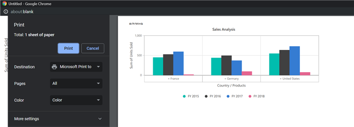
