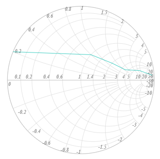
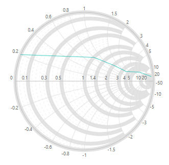
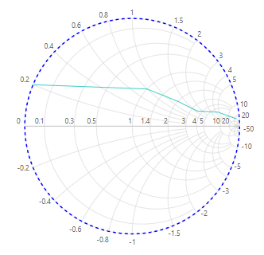

# Axis

Like chart, Smith Chart is having support for two types of axis.
* **Horizontal axis** - axis drawn as straight line in the horizontal direction of the Smith Chart
* **Radial axis** - axis is drawn as circular path

## Labels Customization

Axis labels are used to denote what kind of data is bound for Smith Chart. Using axis labels, you can easily identify in which interval chart is rendered. Using following properties we can customize the axis labels for horizontal and radial axis.

* `LabelPosition` - used to place the labels either inside or outside the axis line.
* `LabelIntersectAction` - used to hide the labels when intersect with other one.
* `SmithChartRadialAxisLabelStyle` and `SmithChartHorizontalAxisLabelStyle` - used to customize the properties such as `FontFamily`, `FontWeight`, `FontStyle`, `Opacity` and `Size`.

```csharp
<SfSmithchart>
    <SmithChartHorizontalAxis>
        <SmithChartHorizontalAxisLabelStyle
            FontFamily="Times New Roman"
            FontWeight="bold"
            FontStyle="Italic"
            Opacity='0.75'
            Size="14px">
        </SmithChartHorizontalAxisLabelStyle>
    </SmithChartHorizontalAxis>
    <SmithChartRadialAxis
        LabelPosition='AxisLabelPosition.Inside'
        LabelIntersectAction='SmithchartLabelIntersectAction.None'>
        <SmithChartRadialAxisLabelStyle
            FontFamily="Times New Roman"
            FontWeight="bold"
            FontStyle="Italic"
            Opacity='0.75'
            Size="14px">
        </SmithChartRadialAxisLabelStyle>
    </SmithChartRadialAxis>
    <SmithchartSeriesCollection>
        <SmithchartSeries Points='FirstTransmissionData'></SmithchartSeries>
    </SmithchartSeriesCollection>
</SfSmithchart>

@code {
    public class SmithDataSource
    {
        public double? resistance;
        public double? reactance;
    };
    private List<SmithDataSource> FirstTransmissionData = new List<SmithDataSource> {
        new SmithDataSource { resistance= 10, reactance= 25 },
        new SmithDataSource { resistance= 6, reactance= 4.5 },
        new SmithDataSource { resistance= 3.5, reactance= 1.6 },
        new SmithDataSource { resistance= 2, reactance= 1.2 },
        new SmithDataSource { resistance= 1, reactance= 0.8 },
        new SmithDataSource { resistance= 0, reactance= 0.2 }
    };
}
```



## Gridlines

To make the data in a chart that displays axes easier to read, you can display horizontal and radial axis gridlines. Gridlines extend from any horizontal and radial axes across the plot area of the Smith Chart.
Both horizontal and radial axis are having support for major as well as minor gridlines. Major gridlines are drawn from the position in which labels are rendered. Minor gridlines are drawn between two major gridlines as per the count we set in settings.

We can customize following things, in major as well as minor gridlines.

* `Width` - used to customize the width of gridlines.
* `DashArray` - used to customize whether gridline have to render as normal line or dashed line.
* `Visible` - used to enable or disable the visibility of the gridlines.
* `Opacity` - used to customize the opacity of the major gridlines.
* `Count` - used to customize the count of the minor gridlines.

```csharp
<SfSmithchart>
    <SmithChartHorizontalAxis>
        <SmithchartMajorGridLines
            Visible='true'
            Opacity='0.8'
            Width='10'>
        </SmithchartMajorGridLines>
        <SmithchartMinorGridLines
            Visible='true'
            DashArray="5"
            Count="10">
        </SmithchartMinorGridLines>
    </SmithChartHorizontalAxis>
    <SmithchartSeriesCollection>
        <SmithchartSeries Points='FirstTransmissionData'></SmithchartSeries>
    </SmithchartSeriesCollection>
</SfSmithchart>

@code {
    public class SmithDataSource
    {
        public double? resistance;
        public double? reactance;
    };
    private List<SmithDataSource> FirstTransmissionData = new List<SmithDataSource> {
        new SmithDataSource { resistance= 10, reactance= 25 },
        new SmithDataSource { resistance= 6, reactance= 4.5 },
        new SmithDataSource { resistance= 3.5, reactance= 1.6 },
        new SmithDataSource { resistance= 2, reactance= 1.2 },
        new SmithDataSource { resistance= 1, reactance= 0.8 },
        new SmithDataSource { resistance= 0, reactance= 0.2 }
    };
}
```



## Axisline

As name suggests that, it is a line in Smith Chart that can be configured to denotes the axis. By default, visibility of the axis line is true. You can customize its visibility by using `Visible` property in axis Line. Other than visibility of the axis line, you can customize the following properties of the axis line.

* `Width` - used to customize the width of the axis line.
* `DashArray` - used to render the axis line as dashed line.
* `Visible` - used to enable or disable the visibility of the axis line.

```csharp
<SfSmithchart>
    <SmithChartHorizontalAxis>
        <SmithchartAxisLine Width="2" Visible="true" DashArray="5" Color="blue"></SmithchartAxisLine>
    </SmithChartHorizontalAxis>
    <SmithchartSeriesCollection>
        <SmithchartSeries Points='FirstTransmissionData'></SmithchartSeries>
    </SmithchartSeriesCollection>
</SfSmithchart>

@code {
    public class SmithDataSource
    {
        public double? resistance;
        public double? reactance;
    };
    private List<SmithDataSource> FirstTransmissionData = new List<SmithDataSource> {
        new SmithDataSource { resistance= 10, reactance= 25 },
        new SmithDataSource { resistance= 6, reactance= 4.5 },
        new SmithDataSource { resistance= 3.5, reactance= 1.6 },
        new SmithDataSource { resistance= 2, reactance= 1.2 },
        new SmithDataSource { resistance= 1, reactance= 0.8 },
        new SmithDataSource { resistance= 0, reactance= 0.2 }
    };
}
```

